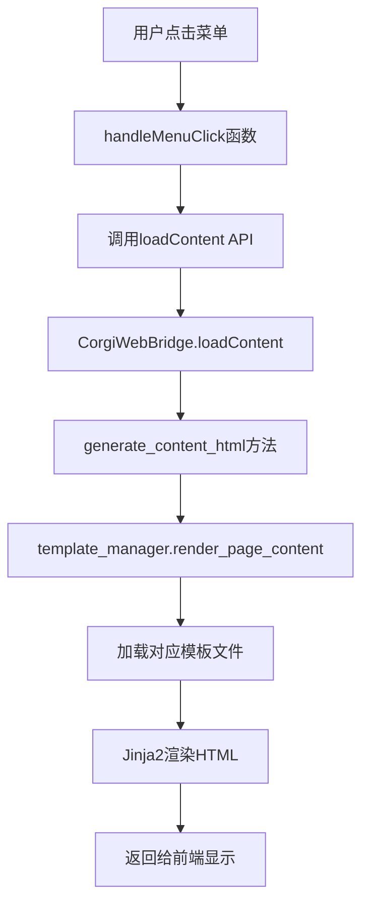

# Gemini CLI 编程指导文档

## 项目概述

LectureLearnLoop 是一个智能学习助手系统，包含两个主要应用程序：

1. **overlay_drag_corgi_app.py** - 基于 Qt6 + WebEngine 的现代化主应用程序，采用分层架构设计，支持多种学习功能包括资料学习、练习生成、知识脑图、网课笔记等。

2. **app_qt.py** - 基于纯 Qt6 的传统桌面应用程序，专注于实时语音转写和总结功能，提供丰富的文本编辑和AI对话功能。

## 项目结构说明

### 核心目录结构

```
LectureLearnLoop/
├── 核心程序层/
│   ├── overlay_drag_corgi_app.py          # 现代化主程序入口 (457KB, 9537行)
│   ├── app_qt.py                          # 传统Qt应用程序 (131KB, 3020行)
│   ├── config.py                          # 全局配置管理
│   ├── template_manager.py                # 模板系统管理器
│   ├── app_config.json                    # 应用配置文件
│   ├── requirements.txt                   # Python依赖包列表
│   └── 启动脚本/
│       ├── start_app_cmd.bat             # 应用启动脚本
│       ├── activate_and_run.bat          # 环境激活脚本
│       └── 启动笔记软件.bat               # 笔记软件启动
│
├── 业务逻辑层/
│   ├── knowledge_management.py           # 知识管理系统核心
│   ├── llm_provider_factory.py          # LLM提供商工厂
│   ├── llm_call_logger.py               # LLM调用日志系统
│   ├── similarity_matcher.py            # 相似度匹配算法
│   └── services/                        # 业务服务目录
│       ├── knowledge_service.py         # 知识点服务
│       ├── practice_service.py          # 练习服务
│       └── learning_path_service.py     # 学习路径服务
│
├── 表示层/
│   ├── templates/                      # 前端模板系统（实际界面）
│   │   ├── base.html                   # 基础模板 (204KB)
│   │   ├── spa_layout.html             # SPA布局模板 (12KB)
│   │   ├── components/                 # 组件模板
│   │   │   ├── sidebar.html            # 侧边栏组件（菜单结构）
│   │   │   └── header.html             # 头部组件
│   │   └── pages/                      # 页面模板（18个文件）
│   │       ├── dashboard.html          # 工作台页面 (4KB)
│   │       ├── learn_from_materials.html # 资料学习页面 (201KB)
│   │       ├── online_course_notes.html  # 网课笔记页面 (314KB)
│   │       ├── practice_materials.html  # 练习脑图页面 (169KB)
│   │       ├── settings.html           # 设置页面 (25KB)
│   │       ├── knowledge_base.html     # 知识库管理页面 (8KB)
│   │       ├── llm_logs.html          # LLM调用日志页面 (13KB)
│   │       └── ...                     # 其他功能页面
│   ├── UI组件/
│   │   ├── practice_panel.py            # 练习面板UI
│   │   ├── error_import_dialog.py       # 错题导入对话框
│   │   ├── error_question_ui.py         # 错题界面组件
│   │   ├── knowledge_point_ui.py        # 知识点界面
│   │   ├── note_knowledge_panel.py      # 笔记知识面板
│   │   └── global_knowledge_panel.py    # 全局知识面板
│   ├── UI/                             # UI设计稿（仅供参考，与项目无关）
│   │   ├── 首页.png                    # 设计稿文件
│   │   ├── 笔记.html                   # 设计稿文件
│   │   ├── 知识库管理.html             # 设计稿文件
│   │   └── ...                         # 其他设计稿（25个文件）
│   └── 前后端通信/
│       ├── QWebChannel                 # Qt与JavaScript通信
│       └── CorgiWebBridge              # 通信桥梁类
│
├── 数据访问层/
│   ├── 数据库文件/
│   │   ├── knowledge_management.db      # 知识管理数据库 (196KB)
│   │   ├──practice_data.db            # 练习数据库 (274KB)
│   │   └── practice_history.db         # 练习历史数据库 (376KB)
│   │
│   └── 数据目录/
│       ├── vault/                      # 学习资料存储
│       ├── course_notes/               # 网课笔记存储
│       ├── practice_sessions/          # 练习会话数据
│       └── recorded_audio_segments/    # 录音片段存储
│
├── 开发与测试/
│   ├── 临时文件/                        # 所有临时和测试文件
│   │   ├── 测试脚本/
│   │   │   ├── test_*.py              # 功能测试脚本 (45个)
│   │   │   └── debug_*.py             # 调试脚本 (12个)
│   │   ├── 备份文件/
│   │   │   ├── *_backup.py            # 代码备份 (8个)
│   │   │   └── *_broken.py            # 损坏代码存档
│   │   ├── 历史版本/
│   │   │   ├── app.py                 # 旧版主程序
│   │   │   ├── app_qt.py              # Qt版本程序
│   │   │   └── enhanced_*.py          # 各种历史版本
│   │   └── 临时测试文件/
│   │       └── test_*.html            # HTML测试文件
│   │
│   └── geminworklog/                   # Gemini工作日志目录
│       ├── 2024-09-29_session_001.md  # 工作会话日志
│       ├── 2024-09-29_session_002.md  # 按日期和会话编号
│       └── summary_weekly.md          # 周总结报告
│
└── 文档系统/
    ├── 说明文档/                        # 当前核心文档
    │   ├── 代码调用跟踪图.md            # 系统调用链路图
    │   ├── API方法索引文档.md           # 完整API接口文档
    │   └── 主程序功能架构分析.md        # 架构分析文档
    │
    └── 说明文档-历史文档/               # 历史开发文档
        ├── 功能实现文档/ (110个)
        ├── 架构设计文档/ (15个)
        └── 修复说明文档/ (11个)
```

## 分层架构设计原则

### 1. 核心程序层 (Core Layer)
**职责**: 应用程序启动、全局配置、主要控制逻辑

**核心应用程序**:
- `overlay_drag_corgi_app.py` - 现代化主程序入口，包含 CorgiWebBridge 通信桥梁
  - 基于 Qt6 + WebEngine 架构
  - 支持完整的学习功能生态系统
  - 采用前后端分离设计
  - 包含知识脑图、学习路径、网课笔记等高级功能

- `app_qt.py` - 传统Qt桌面应用程序
  - 基于纯 Qt6 Widget 架构
  - 专注于实时语音转写和文本处理
  - 包含丰富的文本编辑功能和AI对话系统
  - 提供设备级别监控和音频处理功能

**共享配置文件**:
- `config.py` - 全局配置管理模块
- `app_config.json` - 应用配置文件
- `requirements.txt` - Python依赖包列表
- `template_manager.py` - 模板系统管理（主要用于overlay_drag_corgi_app.py）

**设计原则**:
- 双应用程序架构，各有专长
- 共享配置和核心模块
- 独立运行，互不干扰

### 2. 业务逻辑层 (Business Logic Layer)
**职责**: 核心业务逻辑处理、数据处理、算法实现
**核心模块**:
- 知识管理系统 (`knowledge_management.py`)
- LLM集成服务 (`llm_provider_factory.py`)
- 相似度匹配算法 (`similarity_matcher.py`)

**设计原则**:
- 业务逻辑与UI分离
- 服务化架构设计
- 可插拔的算法组件

### 3. 表示层 (Presentation Layer)
**职责**: 用户界面展示、用户交互处理、前端逻辑
**组成部分**:
- Qt UI组件 (Python)
- Web模板系统 (HTML/CSS/JavaScript)
- 前后端通信桥梁

**设计原则**:
- 模板与业务逻辑严格分离
- 组件化UI设计
- 响应式布局

### 4. 数据访问层 (Data Access Layer)
**职责**: 数据存储、数据库操作、文件系统管理
**组成部分**:
- SQLite数据库
- 文件系统存储
- 数据缓存机制

**设计原则**:
- 数据访问统一接口
- 事务一致性保证
- 数据备份与恢复

## Gemini CLI 编程规范

### 1. 代码修改流程

#### 步骤1: 分析需求
```bash
# 在开始编程前，先分析需求涉及的层次
# 确定修改范围：核心层/业务层/表示层/数据层
```

#### 步骤2: 创建工作分支
```bash
# 为每次重要修改创建独立的工作日志
# 文件命名: YYYY-MM-DD_session_XXX.md
```

#### 步骤3: 遵循分层原则
- **核心层修改**: 影响全局，需要特别谨慎
- **业务层修改**: 确保接口兼容性
- **表示层修改**: 遵循模板分离原则
- **数据层修改**: 考虑数据迁移和备份

#### 步骤4: 测试文件管理
- 所有测试文件必须放在 `临时文件/` 目录下
- 测试文件命名规范: `test_[功能模块]_[具体功能].py`
- 调试文件命名规范: `debug_[问题描述]_[日期].py`

### 2. 工作日志规范

#### 日志文件结构
```markdown
# Gemini工作日志 - YYYY-MM-DD Session XXX

## 会话信息
- **开始时间**: YYYY-MM-DD HH:MM:SS
- **结束时间**: YYYY-MM-DD HH:MM:SS
- **工作目标**: [本次会话的主要目标]
- **涉及模块**: [修改的主要模块]

## 核心改动

### 1. 文件修改列表
- `文件路径` - 修改类型 (新增/修改/删除)
  - 具体改动描述
  - 改动原因
  - 影响范围

### 2. 新增功能
- **功能名称**: 
  - 实现方式
  - 技术要点
  - 测试情况

### 3. 问题修复
- **问题描述**: 
  - 问题原因分析
  - 解决方案
  - 验证结果

## 发现的问题

### 1. 技术问题
- **问题现象**: 
- **根本原因**: 
- **解决状态**: 已解决/待解决/需进一步分析

### 2. 架构问题
- **问题描述**: 
- **影响范围**: 
- **改进建议**: 

## 测试结果

### 1. 功能测试
- **测试项目**: 
- **测试结果**: 通过/失败
- **测试文件**: `临时文件/test_xxx.py`

### 2. 集成测试
- **测试场景**: 
- **测试结果**: 
- **发现问题**: 

## 下次计划
- [ ] 待完成任务1
- [ ] 待完成任务2
- [ ] 需要进一步调研的问题

## 代码质量评估
- **代码复杂度**: 低/中/高
- **测试覆盖率**: XX%
- **性能影响**: 无/轻微/显著
- **兼容性**: 良好/需注意/有问题
```

### 3. 临时文件管理规范

#### 文件分类存储
```
临时文件/
├── 当前开发/
│   ├── test_current_feature.py      # 当前功能测试
│   ├── debug_current_issue.py       # 当前问题调试
│   └── prototype_new_ui.html        # 新UI原型
├── 功能测试/
│   ├── test_knowledge_extraction.py # 知识点提取测试
│   ├── test_mindmap_generation.py   # 脑图生成测试
│   └── test_recording_function.py   # 录音功能测试
├── 性能测试/
│   ├── benchmark_llm_calls.py       # LLM调用性能测试
│   └── memory_usage_analysis.py     # 内存使用分析
└── 历史存档/
    ├── 已完成功能测试/
    └── 已修复问题调试文件/
```

#### 文件命名规范
- **测试文件**: `test_[模块]_[功能]_[日期].py`
- **调试文件**: `debug_[问题]_[日期].py`
- **原型文件**: `prototype_[功能]_[版本].html`
- **备份文件**: `backup_[原文件名]_[日期].py`

### 4. 代码质量标准

#### Python代码规范
```python
# 文件头部注释模板
"""
模块名称: [模块功能描述]
创建时间: YYYY-MM-DD
修改记录: 
- YYYY-MM-DD: [修改内容] - [修改人]
依赖模块: [列出主要依赖]
"""

# 类定义规范
class ExampleClass:
    """
    类功能描述
    
    Attributes:
        attr1 (type): 属性描述
        attr2 (type): 属性描述
    """
    
    def __init__(self):
        """初始化方法"""
        pass
    
    def example_method(self, param1: str, param2: int) -> bool:
        """
        方法功能描述
        
        Args:
            param1 (str): 参数1描述
            param2 (int): 参数2描述
            
        Returns:
            bool: 返回值描述
            
        Raises:
            ValueError: 异常情况描述
        """
        pass
```

#### 前端代码规范
```html
<!-- 模板文件头部注释 -->
<!--
模板名称: [模板功能描述]
创建时间: YYYY-MM-DD
依赖组件: [列出依赖的组件]
API接口: [列出调用的后端接口]
-->

<!-- JavaScript代码规范 -->
<script>
/**
 * 功能模块类
 */
class ExampleModule {
    constructor() {
        this.init();
    }
    
    /**
     * 初始化方法
     */
    init() {
        // 初始化逻辑
    }
    
    /**
     * 方法描述
     * @param {string} param1 - 参数描述
     * @returns {boolean} 返回值描述
     */
    exampleMethod(param1) {
        // 方法实现
    }
}
</script>
```

## 界面渲染机制说明

### 重要说明：UI文件夹与实际界面的关系

**UI/ 文件夹**：
- 包含25个设计稿文件（PNG图片和HTML原型）
- 这些文件仅用于UI设计参考，与实际运行的项目无关
- 不参与程序运行，可以视为设计文档

**实际界面渲染**：
- 所有界面都通过 `templates/` 目录下的模板文件渲染
- 使用 Jinja2 模板引擎 + Tailwind CSS
- 通过 `TemplateManager` 类统一管理

### 界面渲染流程



### 菜单与模板文件映射关系

| 菜单项 | content_id | 模板文件 | 文件大小 | 主要功能 |
|--------|------------|----------|----------|----------|
| 工作台 | `dashboard` | `pages/dashboard.html` | 4KB | 系统概览和快捷入口 |
| 从资料学习 | `learn_from_materials` | `pages/learn_from_materials.html` | 201KB | 文件管理、Markdown编辑、知识点提取 |
| 网课笔记 | `online_course_notes` | `pages/online_course_notes.html` | 314KB | 录音转写、AI总结、笔记编辑 |
| 基于学习资料练习 | `practice_materials` | `pages/practice_materials.html` | 169KB | 知识脑图、学科选择、D3.js可视化 |
| 基于知识点练习 | `practice_knowledge` | `pages/practice_knowledge.html` | 3KB | 知识点练习界面 |
| 基于错题练习 | `practice_errors` | `pages/practice_errors.html` | 3KB | 错题练习界面 |
| 基于知识点记忆 | `memory_knowledge` | `pages/memory_knowledge.html` | 4KB | 知识点记忆界面 |
| 基于错题记忆 | `memory_errors` | `pages/memory_errors.html` | 6KB | 错题记忆界面 |
| 知识库管理 | `knowledge_base` | `pages/knowledge_base.html` | 8KB | 知识库管理界面 |
| 设置 | `settings` | `pages/settings.html` | 25KB | 系统设置界面 |
| LLM调用日志 | `llm_logs` | `pages/llm_logs.html` | 13KB | LLM调用日志查看器 |

### 模板系统架构

#### 1. 基础模板层
- **`base.html`** (204KB) - 包含完整的CSS框架、JavaScript库、基础样式
- **`spa_layout.html`** (12KB) - SPA单页应用布局，定义整体结构

#### 2. 组件模板层
- **`components/sidebar.html`** - 左侧菜单栏，定义所有菜单项和导航逻辑
- **`components/header.html`** - 顶部标题栏和用户信息

#### 3. 页面模板层
- **`pages/`** 目录下18个页面模板文件
- 每个页面对应一个具体功能模块
- 包含完整的HTML结构、CSS样式、JavaScript逻辑

### 模板渲染优先级

1. **优先使用模板系统**：`template_manager.render_page_content(content_id)`
2. **备用生成器**：如果模板加载失败，使用Python中的`generate_*_content()`方法
3. **错误处理**：显示友好的错误提示页面

## 应用程序功能对比

### overlay_drag_corgi_app.py (现代化主应用)
**核心特性**:
- 🌐 Web界面 + Qt后端架构
- 📚 完整的学习管理系统
- 🧠 知识脑图可视化
- 🛤️ 智能学习路径规划
- 📝 网课笔记集成功能
- 🎯 练习生成与评估系统
- 📊 学习数据分析

**适用场景**:
- 系统性学习管理
- 知识体系构建
- 学习进度跟踪
- 多媒体学习内容处理

### app_qt.py (传统Qt应用)
**核心特性**:
- 🎤 实时语音转写功能
- ✍️ 富文本编辑器 (支持Markdown)
- 🤖 AI对话和文本总结
- 📱 设备级别监控
- 💬 对话历史管理
- 🎨 语法高亮显示
- 📸 截图功能集成

**核心类结构**:
- `TranscriptionAppQt` - 主窗口类
- `RichTextEditor` - 富文本编辑器
- `ChatbotPanel` - AI对话面板
- `AudioRecorderWorker` - 录音工作线程
- `TranscriberWorker` - 转写工作线程
- `SummarizerWorker` - 总结工作线程
- `DeviceLevelDialog` - 设备选择对话框

**适用场景**:
- 实时会议记录
- 语音内容转写
- 文档编辑和整理
- AI辅助写作

## 常见问题与解决方案

### 1. 架构相关问题

#### 问题: 模板与业务逻辑混合
**现象**: Python代码中包含HTML字符串
**原因**: 违反了分层架构原则
**解决方案**: 
```python
# 错误做法
def generate_content():
    return "<div>HTML内容</div>"

# 正确做法
def generate_content():
    return self.template_manager.render_page_content('page_name')
```

#### 问题: 前后端通信异常
**现象**: JavaScript调用Python方法失败
**原因**: QWebChannel通信问题
**解决方案**:
```python
# 确保方法使用@Slot装饰器
@Slot(str, result=str)
def api_method(self, param):
    return json.dumps(result, ensure_ascii=False)
```

### 2. 性能相关问题

#### 问题: LLM调用响应慢
**现象**: 用户界面卡顿
**原因**: 同步调用阻塞UI线程
**解决方案**: 使用异步处理或工作线程

#### 问题: 内存使用过高
**现象**: 程序运行一段时间后内存占用增加
**原因**: 可能存在内存泄漏
**解决方案**: 定期检查对象引用，及时释放资源

### 3. 数据相关问题

#### 问题: 数据库锁定
**现象**: 数据库操作失败
**原因**: 多线程同时访问数据库
**解决方案**: 使用数据库连接池和事务管理

## 最佳实践建议

### 1. 开发流程
1. **需求分析** - 明确功能需求和技术要求
2. **架构设计** - 确定涉及的层次和模块
3. **编码实现** - 遵循分层原则和编码规范
4. **单元测试** - 编写测试文件验证功能
5. **集成测试** - 测试模块间的协作
6. **文档更新** - 更新相关文档和日志

### 2. 代码审查要点
- 是否遵循分层架构原则
- 是否符合编码规范
- 是否有适当的错误处理
- 是否有必要的注释和文档
- 是否考虑了性能和安全性

### 3. 版本管理
- 重要功能开发前创建分支
- 及时提交代码变更
- 编写清晰的提交信息
- 定期合并和清理分支

## 工作日志模板

创建新的工作日志时，请复制以下模板：

```bash
# 在 geminworklog 目录下创建新日志文件
# 文件名格式: YYYY-MM-DD_session_XXX.md
```

通过遵循这个指导文档，可以确保 Gemini CLI 编程工作的规范性、可维护性和高质量。每次开发工作都应该有相应的工作日志记录，便于后续的维护和问题排查。
