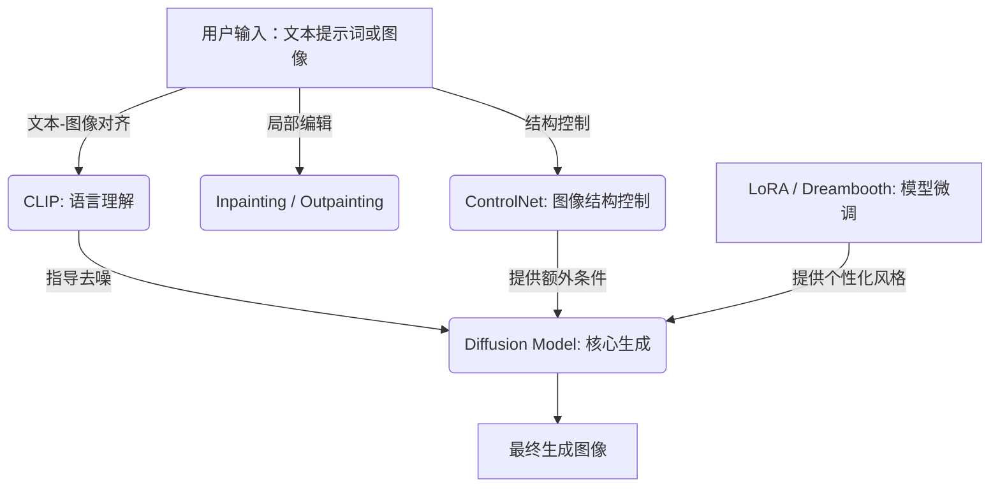

我明白你的意思了。我之前把重点放在了版本兼容性上，忽略了你最初想要了解的，关于这些核心组件之间的整体关系。非常抱歉。

现在，让我们回到最初的问题，全面地梳理一下这些名词：**CUDA**、**PyTorch**、**xformers** 以及 **预编译 wheel**。

### 核心名词关系与工作原理

可以把它们想象成一个团队，它们分工协作，共同完成加速深度学习任务的目标。

  * **CUDA (Compute Unified Device Architecture)**：这是团队的**基础设施**。CUDA 是 NVIDIA 提供的底层技术，它允许软件开发者编写程序来利用 GPU 强大的并行计算能力。你可以把它看作是 GPU 和上层软件之间的“操作系统”，没有它，PyTorch 等框架就无法与 GPU 对话。
  * **PyTorch**：这是团队的**总工程师**或**高级工具**。PyTorch 是一个开源的深度学习框架，它为构建、训练和部署神经网络模型提供了方便、直观的接口。它内部封装了复杂的计算操作（如矩阵乘法、卷积等），并能够通过调用 CUDA 库，将这些操作卸载到 GPU 上执行，从而实现数倍甚至数十倍的加速。
  * **xformers**：这是团队的**效率专家**或**性能优化插件**。xformers 是一个专门为 PyTorch 中的 Transformer 模型设计的库。它包含了一系列经过高度优化的 CUDA 内核（即用 CUDA 编写的底层代码），这些内核比 PyTorch 默认的实现更高效，能显著减少内存占用并提升运行速度。你可以把它看作是 PyTorch 的一个“外挂”，让特定任务跑得更快。
  * **预编译 Wheel**：这是团队的**安装包**或**即用型产品**。在 Python 世界里，`wheel` 文件是一种标准化的分发格式。**预编译**意味着这个包已经针对特定的环境（比如某个 CUDA 版本）提前编译好了，用户下载后可以直接安装，无需再进行复杂的编译过程。它极大地简化了 PyTorch 和 xformers 的安装，用户只需选择与自己电脑 CUDA 版本匹配的 wheel 文件即可。

-----

### 原理说明图

下图展示了这四个组件如何协同工作，让你的深度学习模型在 GPU 上高效运行。

```
+------------------------------------------------+
|          你的 Python 深度学习代码              |
|          (使用 PyTorch 框架)                   |
|                                                |
|             (pip install)                      |
+--------------------|---------------------------+
                     V
+------------------------------------------------+
|          PyTorch (作为高级框架)                |
|  - 包含神经网络模型定义和训练逻辑              |
|  - 可选：使用 xformers 进行性能优化            |
+--------------------|---------------------------+
                     V
+--------------------|---------------------------+
|          CUDA 工具包 (底层库)                  |
|  - 提供了 PyTorch 和 xformers 调用 GPU 的接口  |
|  - 包含用于通用计算的底层函数库                |
+--------------------|---------------------------+
                     V
+--------------------|---------------------------+
|         NVIDIA GPU 硬件 (并行计算核心)         |
|  - 负责执行大规模的矩阵运算和并行任务          |
+------------------------------------------------+

```




