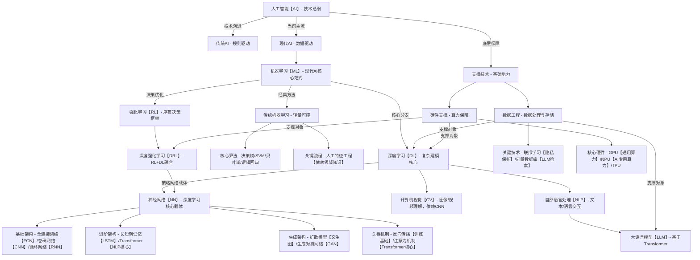

| 技术名称        | 父层级（从属关系）       | 核心定义与作用                                             |
| ----------- | --------------- | --------------------------------------------------- |
| 人工智能（AI）    | 无（顶层范畴）         | 让机器模拟人类智能（理解、决策、创造）的所有技术总称                          |
| 机器学习（ML）    | 属于 AI（现代 AI 核心） | 让机器从数据中自动学习规律，无需人工写死规则的技术框架                         |
| 传统机器学习      | 属于机器学习          | 依赖人工设计特征、小数据训练的机器学习分支（如决策树、SVM）                     |
| 深度学习（DL）    | 属于机器学习（分支）      | 用 “多层神经网络” 自动提取特征、处理大数据的机器学习进阶技术                    |
| 神经网络（NN）    | 属于深度学习（核心载体）    | 模仿人脑神经元连接的数学模型，是深度学习实现的 “物理基础”（如 CNN、Transformer）   |
| 全连接网络（FCN）  | 属于神经网络（基础架构）    | 所有节点全连接的简单神经网络，用于基础分类任务（如 MNIST 手写识别）               |
| 卷积神经网络（CNN） | 属于神经网络（专用架构）    | 用 “卷积核” 提取空间特征，专门处理图像、视频（如人脸识别、自动驾驶视觉）              |
| 循环神经网络（RNN） | 属于神经网络（序列架构）    | 处理时序数据（文本、语音）的架构，但存在 “长记忆丢失” 问题                     |
| LSTM/GRU    | 属于 RNN（改进版）     | 加入 “门控机制” 解决 RNN 长记忆问题，用于早期文本翻译、语音识别                |
| Transformer | 属于神经网络（进阶架构）    | 基于 “自注意力机制”，处理长序列（长文本、视频）更高效，是大模型核心（GPT/ViT）        |
| 扩散模型        | 属于神经网络（生成架构）    | 通过 “逐步去噪” 生成高质量数据（图像：Stable Diffusion；视频：Sora）      |
| 强化学习（RL）    | 属于 AI（与机器学习交叉）  | 让机器通过 “试错” 学习最优策略，可结合深度学习形成深度强化学习（DRL）              |
| 大语言模型（LLM）  | 属于深度学习（NLP 分支）  | 基于 Transformer 解码器，处理海量文本数据的大型神经网络（如 GPT-4、Llama 3） |

```mermaid
graph TD A[人工智能（AI） 顶层范畴：模拟人类智能的技术总称] A --> B[机器学习（ML） 现代AI核心：从数据自动学习规律] A --> C[强化学习（RL） 与ML交叉：试错学习最优策略] B --> B1[传统机器学习 依赖人工特征：决策树/SVM等] B --> B2[深度学习（DL） 多层神经网络：自动提特征+处理大数据] B2 --> D[神经网络（NN） DL核心载体：模仿人脑神经元的数学模型] B2 --> E[大语言模型（LLM） NLP分支：基于Transformer的文本处理模型] D --> D1[全连接网络（FCN） 基础架构：节点全连接，用于基础分类] D --> D2[卷积神经网络（CNN） 专用架构：卷积核提空间特征，处理图像视频] D --> D3[循环神经网络（RNN） 序列架构：处理时序数据，存长记忆丢失问题] D --> D4[Transformer 进阶架构：自注意力机制，大模型核心] D --> D5[扩散模型 生成架构：逐步去噪，生成图像/视频] D3 --> D31[LSTM/GRU RNN改进：门控机制解决长记忆丢失] C --> C1[深度强化学习（DRL） RL+DL融合：用NN做策略网络] C1 -.-> D[神经网络（NN） DL核心载体：模仿人脑神经元的数学模型]
```

![[exported_image.png]]