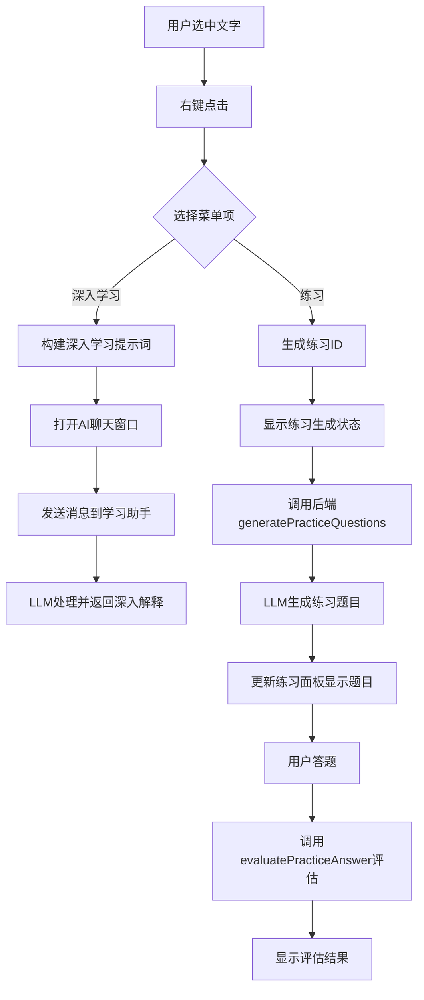

# 学习资料右键菜单功能技术文档

## 功能概述

"学-从资料学习"功能页面中的右键菜单系统，允许用户在Markdown编辑器中选中文字后右键调用"深入学习"和"练习"功能，实现智能化的学习辅助。

## 核心功能

### 1. 深入学习功能
- **触发方式**：选中文字 → 右键 → 点击"继续深入学习"
- **功能描述**：调用LLM对选中内容进行深入解释和分析
- **交互方式**：自动打开AI聊天窗口并发送深入学习提示词

### 2. 练习功能
- **触发方式**：选中文字 → 右键 → 点击"练习"
- **功能描述**：基于选中内容生成个性化练习题目
- **交互方式**：切换到AI练习助手Tab，生成并显示练习题目

## 技术架构

### 前端架构（模板层）

#### 文件位置
- **主模板**：`templates/pages/learn_from_materials.html`
- **基础模板**：`templates/base.html`（包含AI聊天窗口）

#### 核心组件

1. **右键菜单HTML结构**
```html
<div id="contextMenu" class="context-menu">
    <div class="context-menu-item" id="deepLearningMenuItem">
        <span class="material-icons-outlined">psychology</span>
        继续深入学习
    </div>
    <div class="context-menu-item" id="practiceMenuItem">
        <span class="material-icons-outlined">quiz</span>
        练习
    </div>
</div>
```

2. **CSS样式系统**
```css
.context-menu {
    position: fixed;
    background: white;
    border: 1px solid #e5e7eb;
    border-radius: 8px;
    box-shadow: 0 10px 25px rgba(0, 0, 0, 0.15);
    padding: 4px 0;
    z-index: 10000;
    min-width: 180px;
    display: none;
}

.context-menu-item {
    padding: 8px 16px;
    cursor: pointer;
    font-size: 14px;
    color: #374151;
    display: flex;
    align-items: center;
    transition: background-color 0.2s ease;
}
```

#### JavaScript事件系统

1. **初始化流程**
```javascript
// 页面加载时初始化
function initContextMenu() {
    // 检查或创建右键菜单元素
    createContextMenu();
    
    // 绑定全局右键事件监听器
    document.addEventListener('contextmenu', handleContextMenu);
    
    // 绑定菜单项点击事件
    document.getElementById('deepLearningMenuItem')
        .addEventListener('click', handleDeepLearning);
    document.getElementById('practiceMenuItem')
        .addEventListener('click', handlePractice);
    
    // 绑定全局点击隐藏菜单
    document.addEventListener('click', hideContextMenu);
}
```

2. **文本选择检测**
```javascript
function handleContextMenu(e) {
    // 获取选中文本
    const selection = window.getSelection();
    const selectedTextContent = selection.toString().trim();
    
    // 验证文本选择
    if (selectedTextContent.length === 0) {
        return; // 无选中文本时不显示菜单
    }
    
    e.preventDefault();
    selectedText = selectedTextContent;
    
    // 显示右键菜单
    showContextMenu(e.pageX, e.pageY);
}
```

3. **菜单显示逻辑**
```javascript
function showContextMenu(x, y) {
    contextMenu.style.display = 'block';
    contextMenu.style.left = x + 'px';
    contextMenu.style.top = y + 'px';
    
    // 防止菜单超出屏幕边界
    const rect = contextMenu.getBoundingClientRect();
    if (rect.right > window.innerWidth) {
        contextMenu.style.left = (x - rect.width) + 'px';
    }
    if (rect.bottom > window.innerHeight) {
        contextMenu.style.top = (y - rect.height) + 'px';
    }
}
```

### 后端架构（业务逻辑层）

#### 文件位置
- **主要文件**：`overlay_drag_corgi_app.py`
- **LLM集成**：`llm_provider_factory.py`

#### 核心API方法

1. **练习题目生成API**
```python
@Slot(str, result=str)
def generatePracticeQuestions(self, selected_text):
    """根据选中文本生成练习题目"""
    try:
        # 构建生成练习题的提示词
        prompt = f"""请基于以下内容生成一套练习题目：

**学习内容：**
{selected_text}

**要求：**
1. 生成5-8道不同类型的题目（选择题、填空题、简答题、应用题等）
2. 题目要有一定的难度梯度，从基础理解到深入应用
3. 每道题目都要紧密围绕给定的学习内容
4. 题目表述要清晰明确，便于理解
5. 使用纯文本格式，题目编号使用数字格式：1. 2. 3. 等
6. 选择题的选项使用 A) B) C) D) 格式
7. 只提供题目，不要提供答案

请生成练习题目："""

        # 调用LLM API生成题目
        response = call_llm(prompt, "生成练习题目")
        return response if response else self._generate_fallback_questions(selected_text)
        
    except Exception as e:
        self.logger.error(f"❌ 生成练习题目异常: {e}")
        return self._generate_fallback_questions(selected_text)
```

2. **答案评估API**
```python
@Slot(str, result=str)
def evaluatePracticeAnswer(self, evaluation_data_json):
    """评估单个练习答案"""
    try:
        evaluation_data = json.loads(evaluation_data_json)
        question = evaluation_data.get('question', '')
        answer = evaluation_data.get('answer', '')
        
        # 构建评估提示词
        prompt_template = """请作为专业技术面试官，对以下"技术练习答卷"进行严格的逐题评估..."""
        
        # 调用LLM进行评估
        response = call_llm(prompt_template.format(question=question, answer=answer), "评估练习答案")
        return response
        
    except Exception as e:
        self.logger.error(f"❌ 评估练习答案异常: {e}")
        return "评估失败，请稍后重试"
```

## 功能实现流程

### 深入学习流程

1. **用户操作**
   - 在Markdown预览区域选中文字
   - 右键点击选中的文字
   - 点击"继续深入学习"菜单项

2. **前端处理**
   ```javascript
   function handleDeepLearning() {
       // 验证选中文本
       if (!selectedText) {
           showToast('请先选择要深入学习的文本内容', 'warning');
           return;
       }
       
       // 构建深入学习提示词
       const deepLearningPrompt = `请对以下内容进行全面深入的解释和分析：
   
   "${selectedText}"
   
   要求：
   1. 深入浅出地讲解这段内容的核心概念和要点
   2. 提供相关的背景知识和上下文信息  
   3. 举例说明，帮助理解抽象概念
   4. 分析其重要性和实际应用价值
   5. 如果涉及技术概念，请解释其工作原理
   6. 提供进一步学习的建议和相关资源`;
       
       // 打开AI聊天窗口并发送消息
       openChatWithMessage(deepLearningPrompt);
   }
   ```

3. **AI聊天窗口集成**
   ```javascript
   function openChatWithMessage(message) {
       // 打开AI聊天窗口
       if (window.openAIChatWindow) {
           window.openAIChatWindow();
       }
       
       // 延迟发送消息
       setTimeout(() => {
           if (window.sendAIMessage) {
               window.sendAIMessage(message);
           }
       }, 300);
   }
   ```

### 练习功能流程

1. **用户操作**
   - 选中文字 → 右键 → 点击"练习"

2. **前端处理**
   ```javascript
   function handlePractice() {
       // 验证选中文本
       if (!selectedText) {
           showToast('请先选择要练习的文本内容', 'warning');
           return;
       }
       
       // 打开AI聊天窗口
       if (window.openAIChatWindow) {
           window.openAIChatWindow();
       }
       
       // 生成练习ID
       const practiceId = 'practice_' + Date.now();
       
       // 创建练习数据
       const practiceData = {
           id: practiceId,
           selectedText: selectedText,
           questions: null,
           status: 'generating'
       };
       
       // 显示AI练习面板
       if (window.showAIPracticePanel) {
           window.showAIPracticePanel(practiceData);
       }
       
       // 异步生成练习题目
       setTimeout(() => {
           generatePracticeQuestionsForAI(selectedText, practiceId);
       }, 500);
   }
   ```

3. **后端题目生成**
   ```javascript
   function generatePracticeQuestionsForAI(selectedText, practiceId) {
       if (window.bridge && window.bridge.generatePracticeQuestions) {
           try {
               window.bridge.generatePracticeQuestions(selectedText, function(response) {
                   if (response && response.trim()) {
                       // 发送成功消息到AI助手
                       if (window.addAIPracticeMessage) {
                           window.addAIPracticeMessage('**练习题目生成完成！**\n\n' + response, 'ai');
                       }
                       
                       // 更新练习数据
                       const updatedPracticeData = {
                           id: practiceId,
                           selectedText: selectedText,
                           questions: response,
                           status: 'ready'
                       };
                       
                       // 更新练习面板
                       if (window.showAIPracticePanel) {
                           window.showAIPracticePanel(updatedPracticeData);
                       }
                   }
               });
           } catch (error) {
               console.error('调用generatePracticeQuestions失败:', error);
           }
       }
   }
   ```

## AI聊天窗口集成

### 窗口模式切换

1. **小窗口模式**
   - 显示统一的聊天界面
   - 深入学习和练习消息都在同一个聊天区域显示

2. **最大化模式**
   - 显示Tab切换界面："AI学习助手" | "AI练习助手"
   - 深入学习消息显示在"AI学习助手"Tab
   - 练习相关消息和面板显示在"AI练习助手"Tab

### 全局函数接口

```javascript
// 基础模板中定义的全局函数
window.openAIChatWindow = function() {
    // 打开AI聊天窗口
};

window.sendAIMessage = function(message) {
    // 发送消息到AI助手
};

window.addAIPracticeMessage = function(content, type = 'ai') {
    // 添加练习相关消息
};

window.showAIPracticePanel = function(practiceData) {
    // 显示练习面板
};
```

## 数据流程图



## 关键技术特点

### 1. 严格分层架构
- **模板层**：HTML完全在模板文件中，遵循用户规范
- **业务逻辑层**：Python代码仅处理数据和API调用
- **通信层**：QWebChannel桥接前后端交互

### 2. 事件驱动设计
- 基于DOM事件的右键菜单系统
- 异步消息处理机制
- 状态管理和UI更新分离

### 3. LLM集成
- 统一的LLM调用接口（`llm_provider_factory`）
- 支持多种LLM提供者（Ollama、Gemini、DeepSeek等）
- 智能提示词设计和错误处理

### 4. 用户体验优化
- 实时状态反馈
- 智能边界检测（防止菜单超出屏幕）
- 优雅的错误处理和备用方案
- Toast消息提示系统

## 扩展性设计

### 1. 菜单项扩展
可以轻松添加新的右键菜单项：
```javascript
// 在createContextMenu函数中添加新菜单项
menu.innerHTML += `
    <div class="context-menu-item" id="newFeatureMenuItem">
        <span class="material-icons-outlined">new_icon</span>
        新功能
    </div>
`;

// 绑定事件处理器
document.getElementById('newFeatureMenuItem')
    .addEventListener('click', handleNewFeature);
```

### 2. LLM提示词模板化
```python
class PromptTemplates:
    DEEP_LEARNING = """请对以下内容进行全面深入的解释和分析：
    
    "{selected_text}"
    
    要求：
    {requirements}
    """
    
    PRACTICE_GENERATION = """请基于以下内容生成一套练习题目：
    
    **学习内容：**
    {selected_text}
    
    **要求：**
    {requirements}
    """
```

### 3. 插件化架构支持
通过事件系统支持功能插件：
```javascript
// 注册新的右键菜单处理器
window.registerContextMenuHandler = function(id, label, icon, handler) {
    // 动态添加菜单项和处理器
};
```

## 性能优化

### 1. 延迟加载
- 右键菜单元素按需创建
- LLM调用异步处理，不阻塞UI

### 2. 内存管理
- 及时清理事件监听器
- 控制日志数量，避免内存泄漏

### 3. 网络优化
- LLM调用失败时的备用方案
- 请求超时和重试机制

## 错误处理机制

### 1. 前端错误处理
```javascript
try {
    // 主要逻辑
    window.bridge.generatePracticeQuestions(selectedText, callback);
} catch (error) {
    console.error('调用失败:', error);
    showToast('功能暂时不可用，请稍后重试', 'error');
    // 降级到备用方案
    generateMockQuestions(selectedText);
}
```

### 2. 后端错误处理
```python
try:
    response = call_llm(prompt, "生成练习题目")
    return response if response else self._generate_fallback_questions(selected_text)
except Exception as e:
    self.logger.error(f"❌ 生成练习题目异常: {e}")
    return self._generate_fallback_questions(selected_text)
```

### 3. 用户友好的错误提示
- Toast消息系统提供即时反馈
- 详细的错误日志记录便于调试
- 优雅降级，确保基本功能可用

## 总结

这个右键菜单功能系统展现了现代Web应用的最佳实践：

1. **架构清晰**：严格的分层设计，职责分离明确
2. **用户体验优秀**：直观的交互方式，智能的功能集成
3. **技术先进**：LLM集成、事件驱动、异步处理
4. **可维护性强**：模块化设计，易于扩展和修改
5. **健壮性好**：完善的错误处理和备用方案

该系统成功地将传统的文档学习转变为智能化的交互式学习体验，为用户提供了"选中即学习"的便捷功能。
