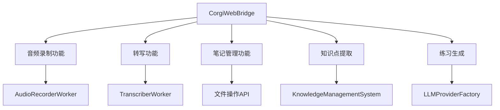
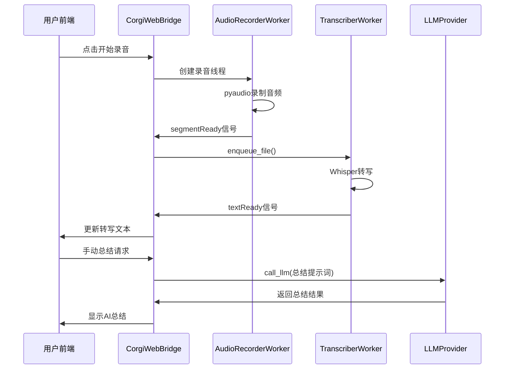
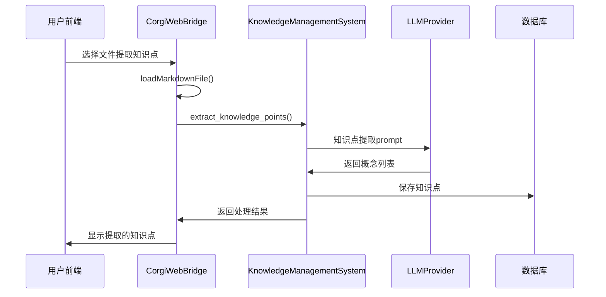

# 网课笔记功能详细分析

> **分析目标**: `overlay_drag_corgi_app.py`中的"网课笔记"功能  
> **文件路径**: `e:\LLM\LectureLearnLoop\overlay_drag_corgi_app.py`  
> **创建时间**: 2025-09-23

---

## 📋 功能概述

网课笔记功能是柯基学习小助手的核心模块之一，集成了音频录制、语音转写、AI总结、笔记管理等完整的网课学习流程。

### 🎯 主要功能
1. **实时音频录制**: 支持多种音频输入设备
2. **语音实时转写**: 使用Whisper模型进行语音转文字
3. **AI智能总结**: 基于LLM的内容总结生成
4. **笔记管理**: Markdown格式的笔记创建、编辑、保存
5. **知识点提取**: 自动识别和提取关键知识点
6. **练习生成**: 基于笔记内容生成练习题目

---

## 🏗️ 架构分析

### 主要入口点

| 功能模块 | 入口位置 | 调用路径 |
|----------|----------|----------|
| 页面加载 | `CorgiWebBridge.loadContent("online_course_notes")` | 前端菜单 → JavaScript → Bridge → 模板渲染 |
| 页面渲染 | `OverlayDragCorgiApp.generate_online_course_notes_content()` | Bridge → 主窗口 → 模板管理器 |
| 模板文件 | `templates/pages/online_course_notes.html` | 6668行完整功能页面 |

### 核心类与组件



---

## 🔧 详细功能分析

### 1. 音频录制模块

#### 1.1 设备管理
**文件位置**: `overlay_drag_corgi_app.py:2051-2300`

**核心方法**:
```python
@Slot(result=str)
def getAudioDevices(self):
    """获取所有音频输入设备列表（分类返回）"""
    # 调用路径: 前端 → CorgiWebBridge.getAudioDevices() → pyaudio枚举设备
```

**功能特点**:
- 自动分类设备（麦克风/系统音频）
- 设备兼容性检测
- 支持WASAPI/VB-Cable等虚拟音频设备

#### 1.2 录音控制
**核心类**: `AudioRecorderWorker` (Line 6532-6642)

**调用链路**:
```
前端startRecording() → CorgiWebBridge.startRecording() → 创建录音线程
→ AudioRecorderWorker.start() → pyaudio录音 → 音频片段生成
→ segmentReady信号 → 转写队列
```

**技术实现**:
- 基于PyAudio的实时音频采集
- 智能静音检测和分段
- 峰值电平监控
- 异常处理和设备回退

### 2. 语音转写模块

#### 2.1 转写引擎
**核心类**: `TranscriberWorker` (Line 6727-6835)

**模型支持**:
- **Faster-Whisper** (优先): 性能优化版本
- **OpenAI Whisper** (备用): 标准版本
- 支持GPU/CPU自动选择

**调用链路**:
```
AudioRecorderWorker.segmentReady → TranscriberWorker.enqueue_file()
→ Whisper模型转写 → textReady信号 → 前端显示
```

#### 2.2 转写配置
**配置位置**: 从`config.py`加载
```python
model_size: "small" | "base" | "large"  # 模型规模
language_setting: "auto" | "zh" | "en"  # 语言设置
```

### 3. 笔记管理模块

#### 3.1 文件操作API
**位置**: `overlay_drag_corgi_app.py:1200-1800`

**核心方法**:
```python
# 文件结构获取
getFileStructure() → vault文件夹扫描 → JSON树结构

# 文件读写
loadMarkdownFile(file_path) → 读取文件 → markdown转HTML
saveMarkdownFile(file_path, content) → 写入文件 → 成功确认

# 文件操作
createNewNote() → 生成模板 → 创建文件
renameFileOrFolder() → 重命名操作
deleteFileOrFolder() → 删除确认
```

#### 3.2 模板系统集成
**模板文件**: `templates/pages/online_course_notes.html`

**技术栈**:
- **Jinja2模板引擎**: 服务端渲染
- **Tailwind CSS**: 样式框架  
- **Material Icons**: 图标库
- **Highlight.js**: 代码高亮
- **KaTeX**: 数学公式渲染
- **Mermaid**: 图表渲染

### 4. AI功能集成

#### 4.1 智能总结
**方法**: `CorgiWebBridge.manualSummary()`

**调用链路**:
```
前端总结请求 → CorgiWebBridge.manualSummary() 
→ LLMProviderFactory.call_llm() → AI模型 → 返回总结
```

**提示词模板**:
```python
summary_prompt = f"""请对以下语音转写内容进行总结，提取关键信息和要点：
{self.transcription_text}
请用Markdown格式输出总结，包括：
1. 主要内容概述  2. 关键知识点  3. 重要细节
总结内容："""
```

#### 4.2 知识点提取
**方法**: `CorgiWebBridge.extractKnowledgePoints()`

**调用链路**:
```
前端提取请求 → extractKnowledgePoints(file_path)
→ KnowledgeManagementSystem.extract_knowledge_points()
→ LLM概念提取 → 格式化输出
```

**集成模块**:
- `knowledge_management.py`: 核心知识管理系统
- `llm_provider_factory.py`: 统一LLM调用接口
- 支持4种LLM提供商: Ollama/Gemini/DeepSeek/Qwen

#### 4.3 练习生成
**方法**: `CorgiWebBridge.generatePracticeQuestions()`

**调用链路**:
```
选中文本 → generatePracticeQuestions(selected_text)
→ LLM题目生成 → 多Provider fallback → 返回题目
```

---

## 🔗 关键文件依赖

### Python文件依赖

| 被调用文件 | 调用位置 | 功能说明 |
|------------|----------|----------|
| `config.py` | `line 67, 1358` | 配置管理加载 |
| `template_manager.py` | `line 4676` | 页面模板渲染 |
| `knowledge_management.py` | `line 1358` | 知识点提取功能 |
| `llm_provider_factory.py` | `line 1358` | LLM统一调用 |
| `llm_call_logger.py` | 导入声明 | API调用日志记录 |

### 核心导入分析
```python
# 音频处理依赖
import pyaudio          # 音频录制
import wave            # 音频文件操作  
import numpy as np     # 音频数据处理

# 语音转写依赖  
import whisper         # OpenAI Whisper
import faster_whisper  # 优化版Whisper
import torch          # GPU支持

# Qt框架依赖
from PySide6.QtCore import QObject, Signal, Slot, QThread
from PySide6.QtWidgets import QMainWindow, QApplication

# 业务模块依赖
from knowledge_management import KnowledgeManagementSystem
from llm_provider_factory import LLMProviderFactory, call_llm
from template_manager import TemplateManager
```

---

## 📊 数据流分析

### 录音→转写→总结流程



### 知识点提取流程



---

## ⚡ 性能特点

### 多线程架构
- **录音线程**: `AudioRecorderWorker` 独立线程，避免UI阻塞
- **转写线程**: `TranscriberWorker` 独立线程，支持队列处理  
- **信号槽机制**: Qt的异步通信，确保线程安全

### 模型优化
- **Faster-Whisper优先**: 相比标准Whisper性能提升2-3倍
- **GPU自动检测**: 自动选择CUDA/CPU进行推理
- **模型缓存**: 避免重复加载模型

### 错误处理
- **设备降级**: 优选设备失败时自动切换默认设备
- **LLM Fallback**: 主要Provider失败时自动切换备用
- **异常隔离**: 单个功能异常不影响整体系统

---

## 🛠️ 开发扩展指南

### 添加新的音频处理功能
1. 在`AudioRecorderWorker`中扩展音频处理逻辑
2. 通过Signal传递处理结果到Bridge  
3. 在前端添加对应的UI控件

### 集成新的语音模型
1. 在`TranscriberWorker`中添加新模型支持
2. 更新模型选择逻辑和配置
3. 处理模型特定的API调用

### 扩展知识管理功能
1. 在`knowledge_management.py`中添加新的提取算法
2. 在Bridge中暴露新的API方法
3. 在前端页面中添加相应功能入口

---

*文档版本: v1.0*  
*分析范围: overlay_drag_corgi_app.py 网课笔记功能*  
*分析深度: 详细到函数级调用链路*