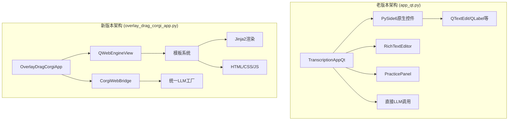
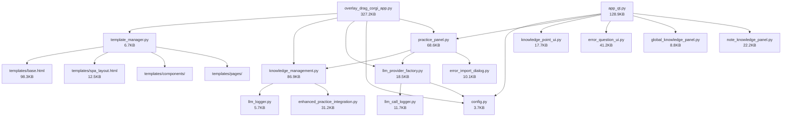
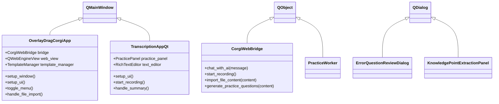
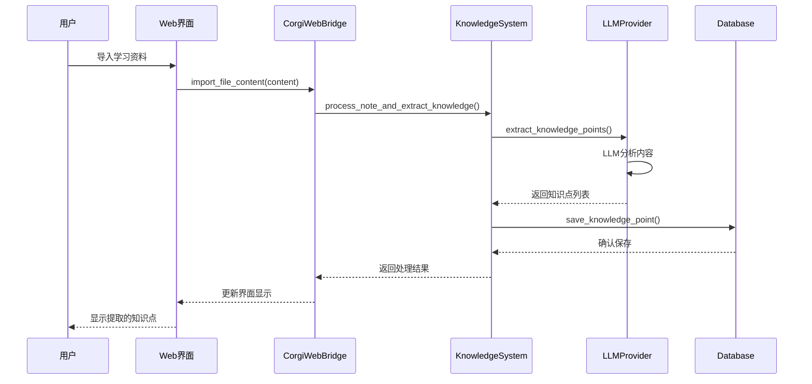
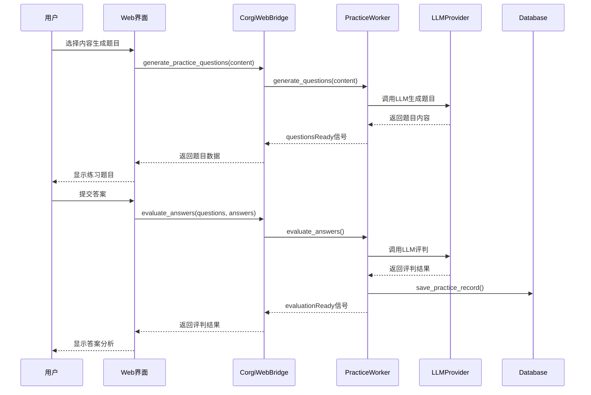

# 柯基学习小助手 - 项目架构详细文档

> **版本**: 2.0  
> **创建时间**: 2025-09-23  
> **文档目的**: 作为后续开发的上下文参考，详细记录文件关系、引用情况、函数调用链路

---

## 📋 目录

1. [项目概述](#项目概述)
2. [双版本架构对比](#双版本架构对比)
3. [核心模块架构](#核心模块架构)
4. [文件依赖关系图](#文件依赖关系图)
5. [关键类与函数引用](#关键类与函数引用)
6. [数据流向分析](#数据流向分析)
7. [技术栈详解](#技术栈详解)
8. [开发规范](#开发规范)

---

## 📖 项目概述

柯基学习小助手是一个基于AI的智能学习辅助系统，支持从文本资料和音视频中学习，并提供练习生成、错题管理、知识点提取等功能。

### 🎯 核心功能
- **语音转写**: 实时音频录制与转写
- **AI聊天助手**: 多LLM提供商支持(Ollama/Gemini/DeepSeek/Qwen)
- **知识点管理**: 自动提取与人工管理
- **练习系统**: 题目生成、答案评判、错题跟踪
- **笔记系统**: Markdown编辑与预览
- **模板系统**: Jinja2模板渲染

---

## 🔄 双版本架构对比

### 版本概况

| 特性 | 老版本 (app_qt.py) | 新版本 (overlay_drag_corgi_app.py) |
|------|-------------------|-------------------------------------|
| **框架** | PySide6 原生控件 | PySide6 + QWebEngineView |
| **UI技术** | Qt原生组件 | HTML/CSS/JavaScript + 模板系统 |
| **文件大小** | 128.9KB | 327.2KB |
| **架构模式** | 传统桌面应用 | Web-Native混合架构 |
| **可维护性** | 中等 | 高 |
| **扩展性** | 受限 | 优秀 |

### 架构对比图



---

## 🏗️ 核心模块架构

### 1. 主程序模块

#### 新版本主程序 (overlay_drag_corgi_app.py)
```python
class OverlayDragCorgiApp(QMainWindow):
    """主应用程序窗口"""
    
    # 核心组件
    self.bridge = CorgiWebBridge(self)      # Web桥接器
    self.web_view = QWebEngineView()        # Web引擎视图
    self.template_manager = TemplateManager() # 模板管理器
    
    # 业务模块
    self.knowledge_system = KnowledgeManagementSystem()
    self.llm_factory = LLMProviderFactory()
    self.practice_processor = EnhancedPracticeProcessor()
```

**核心方法**:
- `setup_window()`: 窗口初始化
- `setup_ui()`: UI组件设置
- `toggle_menu()`: 菜单状态切换
- `handle_file_import()`: 文件导入处理

#### Web桥接器 (CorgiWebBridge)
```python
class CorgiWebBridge(QObject):
    """Web与Python的通信桥梁"""
    
    # 核心功能方法
    @Slot(str, result=str)
    def chat_with_ai(self, message)          # AI聊天
    
    @Slot(str, result=str) 
    def start_recording(self)                # 开始录音
    
    @Slot(str, result=str)
    def import_file_content(self, content)   # 导入文件内容
    
    @Slot(str, result=str)
    def generate_practice_questions(self, content) # 生成练习题
```

### 2. 配置管理模块 (config.py)

```python
# 核心配置结构
default_config = {
    "llm_provider": "Ollama",              # 当前LLM提供商
    
    # Ollama配置
    "ollama_model": "deepseek-r1:1.5b",
    "ollama_api_url": "http://localhost:11434/api/generate",
    
    # Gemini配置  
    "gemini_api_key": "",
    "gemini_model": "gemini-1.5-flash-002",
    
    # DeepSeek配置
    "deepseek_api_key": "",
    "deepseek_model": "deepseek-chat",
    "deepseek_api_url": "https://api.deepseek.com/v1/chat/completions",
    
    # 通义千问配置
    "qwen_api_key": "",
    "qwen_model": "qwen-flash",
}

# 核心函数
def load_config() -> dict              # 加载配置
def save_config(config: dict) -> bool  # 保存配置
```

### 3. LLM提供商工厂 (llm_provider_factory.py)

```python
class LLMProviderFactory:
    """LLM提供商统一管理"""
    
    # 支持的提供商
    - OllamaProvider
    - GeminiProvider  
    - DeepSeekProvider
    - QwenProvider
    
    # 核心方法
    def get_provider(self) -> LLMProvider    # 获取当前提供商
    def call_llm(self, prompt: str) -> str   # 统一调用接口
    def test_current_provider() -> tuple     # 连接测试
```

### 4. 知识管理系统 (knowledge_management.py)

```python
class DatabaseManager:
    """数据库管理器"""
    # 表结构
    - user_subjects              # 用户学科表
    - knowledge_points           # 知识点表
    - practice_records           # 练习记录表
    - error_questions            # 错题表
    - notes                      # 笔记表
    - knowledge_point_sources    # 知识点来源关联表

class KnowledgePointManager:
    """知识点管理器"""
    def extract_knowledge_points(self, subject_name, note_content)  # 提取知识点
    def save_knowledge_point(self, subject_name, point_name, core_description)  # 保存知识点
    def find_similar_knowledge_points(self, subject_name, new_point)  # 查找相似知识点

class ErrorQuestionManager:
    """错题管理器"""
    def get_error_questions_by_knowledge_point(self, subject_name, knowledge_point_id)  # 获取错题
    def update_error_question_content(self, error_question_id, new_content)  # 更新错题内容
    def delete_error_question(self, error_question_id)  # 删除错题
```

### 5. 模板系统 (template_manager.py)

```python
class TemplateManager:
    """Jinja2模板管理器"""
    
    def __init__(self, template_dir="templates"):
        self.env = Environment(
            loader=FileSystemLoader(str(template_dir)),
            autoescape=select_autoescape(['html', 'xml'])
        )
    
    # 核心渲染方法
    def render_spa_layout(self, **context)           # 渲染SPA主布局
    def render_page_content(self, page_name, **context)  # 渲染页面内容
    def render_component(self, component_name, **context)  # 渲染组件
```

#### 模板目录结构
```
templates/
├── base.html                    # 基础模板 (98.3KB)
├── spa_layout.html              # SPA主布局 (12.5KB)
├── components/                  # 组件模板
│   ├── header.html              # 顶部栏组件
│   └── sidebar.html             # 侧边栏组件 (6.7KB)
└── pages/                       # 页面模板 (17个页面)
    ├── dashboard.html           # 工作台页面
    ├── learn_from_materials.html # 从资料学习 (197.0KB)
    ├── learn_from_audio.html    # 从音视频学习 (213.8KB)
    ├── online_course_notes.html # 网课笔记 (280.9KB)
    ├── settings.html            # 设置页面 (24.9KB)
    └── ...                      # 其他页面
```

### 6. 练习系统 (practice_panel.py)

```python
class PracticeWorker(QObject):
    """练习题生成与评判工作线程"""
    
    # 信号定义
    questionsReady = Signal(str)      # 题目生成完成
    evaluationReady = Signal(str)     # 评判完成
    status = Signal(str)              # 状态更新
    
    # 核心方法
    def generate_questions(self, selected_text)  # 生成练习题
    def evaluate_answers(self, questions, answers)  # 评判答案
    def _generate_with_deepseek(self, prompt)    # DeepSeek题目生成
    def _generate_with_gemini(self, prompt)      # Gemini题目生成
    def _generate_with_ollama(self, prompt)      # Ollama题目生成
```

### 7. 日志系统 (llm_call_logger.py)

```python
@dataclass
class LLMCallRecord:
    """LLM调用记录数据结构"""
    call_id: str                    # 调用唯一ID
    timestamp: str                  # 调用时间戳
    provider: str                   # 提供商名称
    model: str                      # 模型名称
    prompt_length: int              # 提示词长度
    response_length: int            # 响应长度
    total_duration: float           # 总耗时(秒)
    time_to_first_byte: float       # 首字节时间(秒)
    success: bool                   # 是否成功
    error_message: str              # 错误信息

class LLMCallLogger:
    """LLM调用日志记录器"""
    def start_call(self, provider, model, prompt, context)  # 开始记录
    def record_first_byte(self, call_id)                    # 记录首字节时间
    def end_call(self, call_id, response, success)          # 结束记录
```

---

## 🔗 文件依赖关系图

### 核心依赖关系



### 导入关系统计

通过grep分析发现的主要导入关系：

```python
# app_qt.py (老版本) 的主要导入
from PySide6.QtWidgets import (QMainWindow, QVBoxLayout, QHBoxLayout, ...)
from PySide6.QtGui import (QFont, QTextCursor, QPixmap, ...)
from PySide6.QtCore import Qt, QTimer, QUrl, QThread, Signal, Slot, QObject
from config import load_config, save_config, SUMMARY_PROMPT
from practice_panel import PracticePanel

# overlay_drag_corgi_app.py (新版本) 的主要导入
from template_manager import TemplateManager
from knowledge_management import KnowledgeManagementSystem
from llm_provider_factory import LLMProviderFactory, call_llm
from enhanced_practice_integration import EnhancedPracticeProcessor

# 模块间循环依赖检查: 无发现严重循环依赖
```

---

## 🎯 关键类与函数引用

### 主要类继承关系



### 核心函数调用链

#### 1. 文件导入处理链
```python
# 调用链: UI操作 → Web桥接 → 文件处理 → 知识点提取
CorgiWebBridge.import_file_content(content)
    └── KnowledgeManagementSystem.process_note_and_extract_knowledge()
        └── KnowledgePointManager.extract_knowledge_points()
            └── LLMProviderFactory.call_llm()
                └── [OllamaProvider|GeminiProvider|DeepSeekProvider].call()
```

#### 2. 练习题生成链
```python
# 调用链: 用户选择文本 → 生成题目 → 多LLM fallback
CorgiWebBridge.generate_practice_questions(content)
    └── PracticeWorker.generate_questions()
        └── PracticeWorker._generate_practice_questions()
            ├── _generate_with_deepseek()  # 首选
            ├── _generate_with_gemini()    # 备用
            └── _generate_with_ollama()    # 最终备用
```

#### 3. AI聊天处理链
```python
# 调用链: 用户输入 → LLM调用 → 日志记录
CorgiWebBridge.chat_with_ai(message)
    └── LLMProviderFactory.call_llm(prompt)
        └── [具体Provider].call(prompt)
            └── LLMCallLogger.start_call() / end_call()
```

#### 4. 模板渲染链
```python
# 调用链: 页面切换 → 模板加载 → 内容渲染
CorgiWebBridge.load_page(page_name)
    └── TemplateManager.render_page_content(page_name)
        └── Jinja2.Environment.get_template()
            └── template.render(**context)
```

### 数据库操作链

```python
# 知识点操作
DatabaseManager.init_database()  # 初始化数据库结构
    ├── user_subjects (用户学科表)
    ├── knowledge_points (知识点表)  
    ├── practice_records (练习记录表)
    ├── error_questions (错题表)
    ├── notes (笔记表)
    └── knowledge_point_sources (知识点来源关联表)

# 错题管理操作
ErrorQuestionManager.get_error_questions_by_knowledge_point()
ErrorQuestionManager.update_error_question_content()
ErrorQuestionManager.delete_error_question()
ErrorQuestionManager.mark_as_reviewed()
```

---

## 💧 数据流向分析

### 1. 学习资料处理流程



### 2. 练习系统流程



### 3. 配置管理流程

```mermaid
flowchart LR
    A[config.py] --> B[load_config()]
    B --> C[app_config.json]
    C --> D[配置对象]
    D --> E[LLMProviderFactory]
    E --> F[具体Provider实例]
    
    G[用户修改设置] --> H[save_config()]
    H --> C
    C --> I[重新加载Provider]
    I --> F
```

---

## 🛠️ 技术栈详解

### 前端技术栈
- **框架**: QWebEngineView (基于Chromium)
- **模板引擎**: Jinja2 (Python)
- **样式框架**: Tailwind CSS
- **图标库**: Material Icons
- **JavaScript**: 原生ES6+
- **通信机制**: Qt WebChannel

### 后端技术栈
- **主框架**: PySide6 (Qt for Python)
- **HTTP客户端**: requests
- **数据库**: SQLite3
- **音频处理**: pyaudio, whisper
- **图像处理**: PIL (Pillow)
- **日志系统**: Python logging
- **配置管理**: JSON

### LLM集成架构
- **支持提供商**: Ollama、Gemini、DeepSeek、通义千问
- **统一接口**: LLMProviderFactory工厂模式
- **自动降级**: 主要提供商失败时自动切换备用
- **日志追踪**: 完整的调用链路日志
- **错误处理**: 详细的错误信息与重试机制

### 数据持久化
- **主数据库**: SQLite3 (knowledge_management.db)
- **日志文件**: JSONL格式的LLM调用日志
- **配置文件**: app_config.json
- **模板缓存**: Jinja2内置缓存机制

---

## 📁 详细文件说明

### 核心程序文件

| 文件名 | 大小 | 功能描述 | 关键类/函数 |
|--------|------|----------|-------------|
| `overlay_drag_corgi_app.py` | 327.2KB | 新版本主程序 | `OverlayDragCorgiApp`, `CorgiWebBridge` |
| `app_qt.py` | 128.9KB | 老版本主程序 | `TranscriptionAppQt`, `RichTextEditor` |
| `knowledge_management.py` | 86.9KB | 知识管理系统 | `DatabaseManager`, `KnowledgePointManager` |
| `practice_panel.py` | 68.6KB | 练习系统 | `PracticeWorker`, `PracticePanel` |
| `error_question_ui.py` | 41.2KB | 错题管理UI | `ErrorQuestionReviewDialog` |
| `enhanced_practice_integration.py` | 31.2KB | 增强练习集成 | `EnhancedPracticeProcessor` |

### 配置与工具文件

| 文件名 | 大小 | 功能描述 | 关键类/函数 |
|--------|------|----------|-------------|
| `llm_provider_factory.py` | 18.5KB | LLM提供商工厂 | `LLMProviderFactory`, `OllamaProvider` |
| `llm_call_logger.py` | 11.7KB | LLM调用日志 | `LLMCallLogger`, `LLMCallRecord` |
| `template_manager.py` | 6.7KB | 模板管理器 | `TemplateManager` |
| `config.py` | 3.7KB | 配置管理 | `load_config()`, `save_config()` |
| `llm_logger.py` | 5.7KB | 基础日志工具 | `log_gemini_call()`, `log_ollama_call()` |

### UI模板文件

| 文件名 | 大小 | 功能描述 | 技术特点 |
|--------|------|----------|----------|
| `templates/base.html` | 98.3KB | 基础模板 | Tailwind CSS、Material Icons |
| `templates/pages/online_course_notes.html` | 280.9KB | 网课笔记页面 | 完整的笔记功能 |
| `templates/pages/learn_from_audio.html` | 213.8KB | 音视频学习页面 | 音频录制与转写 |
| `templates/pages/learn_from_materials.html` | 197.0KB | 资料学习页面 | 文件导入与处理 |
| `templates/pages/settings.html` | 24.9KB | 设置页面 | LLM配置界面 |

### 调试与测试文件

| 文件名 | 大小 | 功能描述 |
|--------|------|----------|
| `debug_backend_files.py` | 6.5KB | 后端文件调试 |
| `debug_knowledge_extraction_v2.py` | 5.4KB | 知识提取调试 |
| `validate_backend.py` | 1.1KB | 后端验证 |
| `simple_test.py` | 0.9KB | 简单测试 |

---

## 🔧 开发规范

### 代码组织规范

1. **模块化原则**
   - 单一职责：每个模块专注一个核心功能
   - 松耦合：模块间通过接口通信
   - 高内聚：相关功能聚集在同一模块

2. **文件命名规范**
   ```
   模块文件: lowercase_with_underscores.py
   类名: PascalCase
   函数名: snake_case
   常量: UPPER_CASE_WITH_UNDERSCORES
   ```

3. **导入顺序**
   ```python
   # 1. 标准库导入
   import os
   import json
   from datetime import datetime
   
   # 2. 第三方库导入
   from PySide6.QtWidgets import QMainWindow
   import requests
   
   # 3. 本地模块导入
   from config import load_config
   from knowledge_management import DatabaseManager
   ```

### LLM调用规范

1. **统一调用接口**
   ```python
   # 推荐: 使用工厂模式
   from llm_provider_factory import call_llm
   result = call_llm(prompt, context="具体业务场景")
   
   # 避免: 直接调用具体提供商
   # 不推荐直接使用特定API
   ```

2. **错误处理规范**
   ```python
   try:
       result = call_llm(prompt)
   except Exception as e:
       # 记录详细错误信息
       self.logger.error(f"LLM调用失败: {e}")
       # 提供用户友好的错误提示
       return "抱歉，AI服务暂时不可用，请稍后重试"
   ```

3. **日志记录规范**
   - 所有LLM调用必须记录日志
   - 包含调用时间、提供商、模型、提示词长度等信息
   - 记录响应时间和成功/失败状态

### 模板开发规范

1. **模板结构**
   ```html
   
   
   页面标题
   
   
   <!-- 页面内容 -->
   
   
   
   {{ super() }}
   <!-- 页面特定脚本 -->
   
   ```

2. **样式规范**
   - 使用Tailwind CSS utility classes
   - 保持一致的颜色主题
   - 响应式设计考虑

3. **JavaScript规范**
   - 使用ES6+语法
   - 避免全局变量污染
   - 通过bridge对象与Python通信

### 数据库操作规范

1. **连接管理**
   ```python
   # 推荐: 使用with语句或try-finally
   conn = self.db_manager.get_connection()
   try:
       cursor = conn.cursor()
       # 数据库操作
       conn.commit()
   except Exception as e:
       conn.rollback()
       raise
   finally:
       conn.close()
   ```

2. **SQL安全**
   - 使用参数化查询防止SQL注入
   - 避免字符串拼接构造SQL

3. **事务处理**
   - 相关操作放在同一事务中
   - 异常时及时回滚

---

## 🚀 扩展开发指南

### 添加新的LLM提供商

1. **创建提供商类**
   ```python
   class NewLLMProvider(LLMProvider):
       def __init__(self, config, logger=None):
           super().__init__(config, logger)
           # 初始化配置
       
       def call(self, prompt: str, context: str = "") -> Optional[str]:
           # 实现具体的API调用逻辑
           pass
   ```

2. **注册到工厂**
   ```python
   # 在LLMProviderFactory.get_provider()中添加
   elif selected_provider == "NewLLM":
       provider = NewLLMProvider(config, self.logger)
   ```

3. **更新配置**
   ```python
   # 在config.py的default_config中添加
   "newllm_api_key": "",
   "newllm_model": "default-model",
   "newllm_is_selected": False,
   ```

### 添加新的页面模板

1. **创建页面模板**
   ```html
   <!-- templates/pages/new_feature.html -->
   
   
   新功能 - 柯基学习小助手
   
   
   <div class="bg-white rounded-xl shadow-sm p-6">
       <h2 class="text-xl font-semibold mb-4">新功能</h2>
       <!-- 页面内容 -->
   </div>
   
   ```

2. **添加菜单项**
   ```html
   <!-- 在sidebar.html中添加菜单项 -->
   <li class="menu-item" onclick="handleMenuClick('new_feature')">
       <span class="material-icons-outlined">new_releases</span>
       <span class="menu-text">新功能</span>
   </li>
   ```

3. **实现后端逻辑**
   ```python
   # 在CorgiWebBridge中添加处理方法
   @Slot(str, result=str)
   def handle_new_feature(self, data):
       # 实现具体业务逻辑
       return json.dumps({"status": "success"})
   ```

### 数据库模式迁移

1. **添加新表**
   ```python
   # 在DatabaseManager.init_database()中添加
   cursor.execute('''
       CREATE TABLE IF NOT EXISTS new_table (
           id INTEGER PRIMARY KEY AUTOINCREMENT,
           field1 TEXT NOT NULL,
           created_time TIMESTAMP DEFAULT CURRENT_TIMESTAMP
       )
   ''')
   ```

2. **添加新列**
   ```python
   # 轻量级迁移
   try:
       cursor.execute("ALTER TABLE existing_table ADD COLUMN new_field TEXT DEFAULT NULL")
   except Exception:
       pass  # 列已存在
   ```

---

## 📝 开发上下文要点

### 当前技术债务

1. **老版本兼容性**
   - app_qt.py仍在使用，需要逐步迁移功能
   - 部分UI组件重复实现

2. **代码重构需求**
   - 大文件拆分 (overlay_drag_corgi_app.py 327KB)
   - 减少直接的LLM API调用，统一使用工厂模式

3. **性能优化点**
   - 大型模板文件缓存优化
   - 数据库查询优化
   - LLM调用并发控制

### 开发注意事项

1. **跨平台兼容性**
   - 文件路径使用Path对象
   - 避免硬编码系统相关路径

2. **国际化准备**
   - 用户界面文本提取为常量
   - 模板文本支持多语言

3. **安全考虑**
   - API密钥安全存储
   - 用户输入验证
   - SQL注入防护

### 未来发展方向

1. **架构演进**
   - 完全迁移到Web-Native架构
   - 微服务化LLM调用
   - 插件化功能扩展

2. **功能增强**
   - 更多LLM提供商支持
   - 实时协作功能
   - 移动端适配

3. **用户体验**
   - 响应式设计优化
   - 无障碍访问支持
   - 个性化主题定制

---

*文档最后更新: 2025-09-23*  
*维护者: AI开发团队*  
*版本: v2.0-详细架构文档*