# LectureLearnLoop 代码调用跟踪图

## 应用程序启动流程

### overlay_drag_corgi_app.py 启动流程

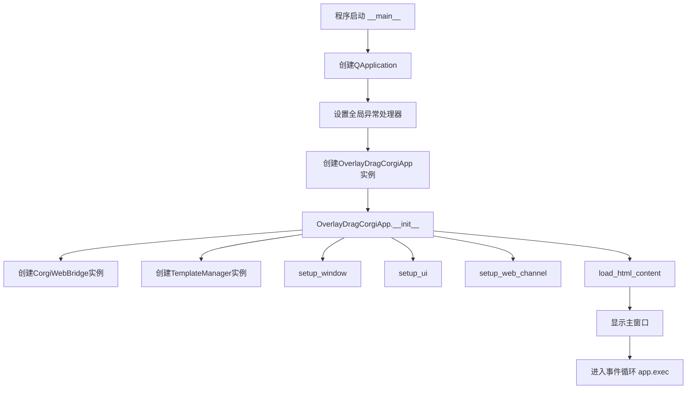
```mermaid
graph TD
    A[程序启动 __main__] --> B[创建QApplication]
    B --> C[设置全局异常处理器]
    C --> D[创建OverlayDragCorgiApp实例]
    D --> E[OverlayDragCorgiApp.__init__]
    E --> F[创建CorgiWebBridge实例]
    E --> G[创建TemplateManager实例]
    E --> H[setup_window]
    E --> I[setup_ui]
    E --> J[setup_web_channel]
    E --> K[load_html_content]
    K --> L[显示主窗口]
    L --> M[进入事件循环 app.exec]
```

### app_qt.py 启动流程

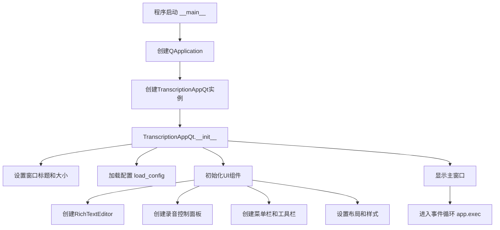
```mermaid
graph TD
    A1[程序启动 __main__] --> B1[创建QApplication]
    B1 --> C1[创建TranscriptionAppQt实例]
    C1 --> D1[TranscriptionAppQt.__init__]
    D1 --> E1[设置窗口标题和大小]
    D1 --> F1[加载配置 load_config]
    D1 --> G1[初始化UI组件]
    G1 --> H1[创建RichTextEditor]
    G1 --> I1[创建录音控制面板]
    G1 --> J1[创建菜单栏和工具栏]
    G1 --> K1[设置布局和样式]
    D1 --> L1[显示主窗口]
    L1 --> M1[进入事件循环 app.exec]
```

## 核心类关系图

### overlay_drag_corgi_app.py 类关系图

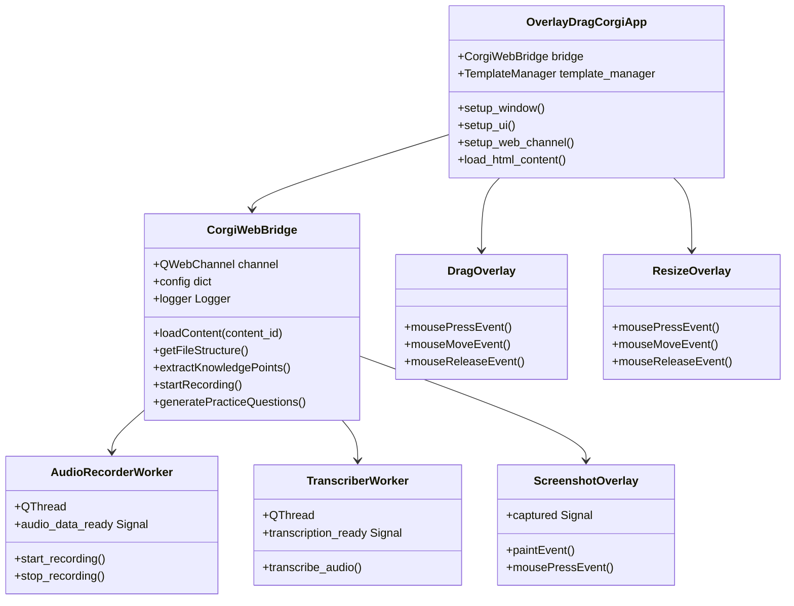
```mermaid
classDiagram
    class OverlayDragCorgiApp {
        +CorgiWebBridge bridge
        +TemplateManager template_manager
        +setup_window()
        +setup_ui()
        +setup_web_channel()
        +load_html_content()
    }
    
    class CorgiWebBridge {
        +QWebChannel channel
        +config dict
        +logger Logger
        +loadContent(content_id)
        +getFileStructure()
        +extractKnowledgePoints()
        +startRecording()
        +generatePracticeQuestions()
    }
    
    class DragOverlay {
        +mousePressEvent()
        +mouseMoveEvent()
        +mouseReleaseEvent()
    }
    
    class ResizeOverlay {
        +mousePressEvent()
        +mouseMoveEvent()
        +mouseReleaseEvent()
    }
    
    class AudioRecorderWorker {
        +QThread
        +start_recording()
        +stop_recording()
        +audio_data_ready Signal
    }
    
    class TranscriberWorker {
        +QThread
        +transcribe_audio()
        +transcription_ready Signal
    }
    
    class ScreenshotOverlay {
        +captured Signal
        +paintEvent()
        +mousePressEvent()
    }
    
    OverlayDragCorgiApp --> CorgiWebBridge
    OverlayDragCorgiApp --> DragOverlay
    OverlayDragCorgiApp --> ResizeOverlay
    CorgiWebBridge --> AudioRecorderWorker
    CorgiWebBridge --> TranscriberWorker
    CorgiWebBridge --> ScreenshotOverlay
```

### app_qt.py 类关系图

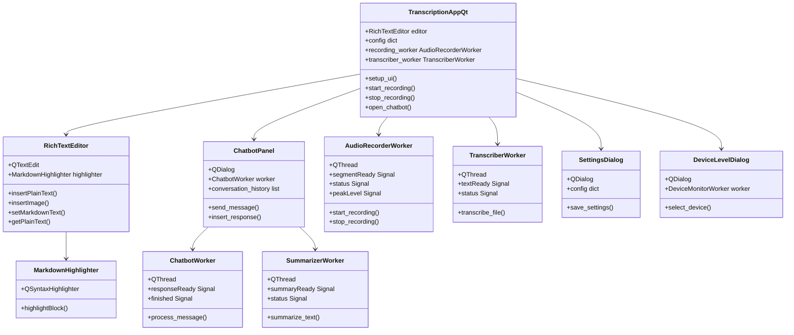
```mermaid
classDiagram
    class TranscriptionAppQt {
        +RichTextEditor editor
        +config dict
        +recording_worker AudioRecorderWorker
        +transcriber_worker TranscriberWorker
        +setup_ui()
        +start_recording()
        +stop_recording()
        +open_chatbot()
    }
    
    class RichTextEditor {
        +QTextEdit
        +MarkdownHighlighter highlighter
        +insertPlainText()
        +insertImage()
        +setMarkdownText()
        +getPlainText()
    }
    
    class ChatbotPanel {
        +QDialog
        +ChatbotWorker worker
        +conversation_history list
        +send_message()
        +insert_response()
    }
    
    class AudioRecorderWorker {
        +QThread
        +segmentReady Signal
        +status Signal
        +peakLevel Signal
        +start_recording()
        +stop_recording()
    }
    
    class TranscriberWorker {
        +QThread
        +textReady Signal
        +status Signal
        +transcribe_file()
    }
    
    class SummarizerWorker {
        +QThread
        +summaryReady Signal
        +status Signal
        +summarize_text()
    }
    
    class ChatbotWorker {
        +QThread
        +responseReady Signal
        +finished Signal
        +process_message()
    }
    
    class MarkdownHighlighter {
        +QSyntaxHighlighter
        +highlightBlock()
    }
    
    class SettingsDialog {
        +QDialog
        +config dict
        +save_settings()
    }
    
    class DeviceLevelDialog {
        +QDialog
        +DeviceMonitorWorker worker
        +select_device()
    }
    
    TranscriptionAppQt --> RichTextEditor
    TranscriptionAppQt --> ChatbotPanel
    TranscriptionAppQt --> AudioRecorderWorker
    TranscriptionAppQt --> TranscriberWorker
    TranscriptionAppQt --> SettingsDialog
    TranscriptionAppQt --> DeviceLevelDialog
    RichTextEditor --> MarkdownHighlighter
    ChatbotPanel --> ChatbotWorker
    ChatbotPanel --> SummarizerWorker
```

## 界面渲染调用链

### 重要说明：UI文件夹与实际界面的关系

**UI/ 文件夹**：
- 包含25个设计稿文件（PNG图片和HTML原型）
- 仅用于UI设计参考，与实际运行的项目无关
- 不参与程序运行，可以视为设计文档

**实际界面渲染**：
- 所有界面都通过 `templates/` 目录下的模板文件渲染
- 使用 Jinja2 模板引擎统一管理

### 界面渲染调用链

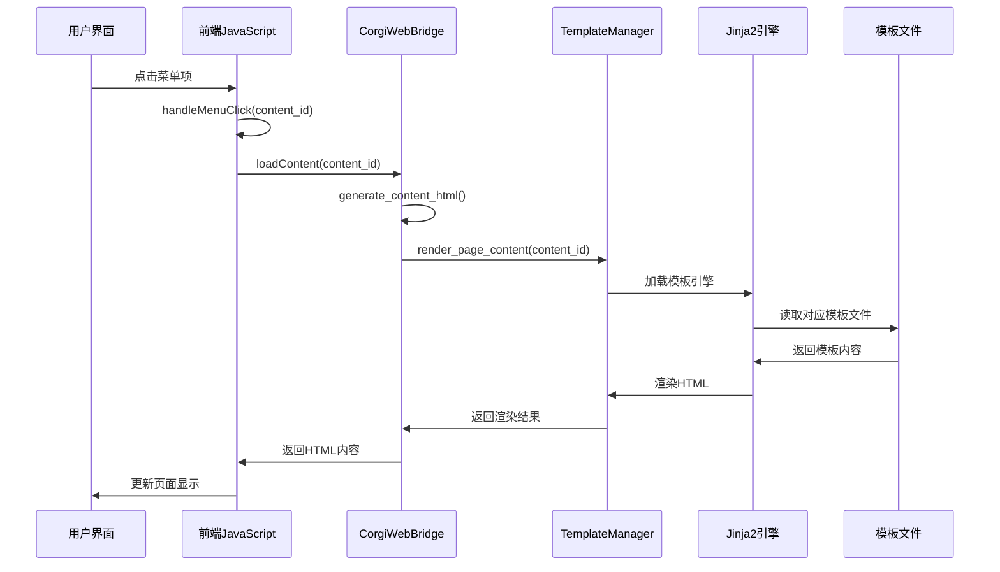
```mermaid
sequenceDiagram
    participant U as 用户界面
    participant JS as 前端JavaScript
    participant B as CorgiWebBridge
    participant TM as TemplateManager
    participant J as Jinja2引擎
    participant F as 模板文件
    
    U->>JS: 点击菜单项
    JS->>JS: handleMenuClick(content_id)
    JS->>B: loadContent(content_id)
    B->>B: generate_content_html()
    B->>TM: render_page_content(content_id)
    TM->>J: 加载模板引擎
    J->>F: 读取对应模板文件
    F->>J: 返回模板内容
    J->>TM: 渲染HTML
    TM->>B: 返回渲染结果
    B->>JS: 返回HTML内容
    JS->>U: 更新页面显示
```

### 菜单与模板文件映射

| 菜单项 | content_id | 模板文件路径 | 文件大小 |
|--------|------------|--------------|----------|
| 工作台 | `dashboard` | `templates/pages/dashboard.html` | 4KB |
| 从资料学习 | `learn_from_materials` | `templates/pages/learn_from_materials.html` | 201KB |
| 网课笔记 | `online_course_notes` | `templates/pages/online_course_notes.html` | 314KB |
| 基于学习资料练习 | `practice_materials` | `templates/pages/practice_materials.html` | 169KB |
| 基于知识点练习 | `practice_knowledge` | `templates/pages/practice_knowledge.html` | 3KB |
| 基于错题练习 | `practice_errors` | `templates/pages/practice_errors.html` | 3KB |
| 基于知识点记忆 | `memory_knowledge` | `templates/pages/memory_knowledge.html` | 4KB |
| 基于错题记忆 | `memory_errors` | `templates/pages/memory_errors.html` | 6KB |
| 知识库管理 | `knowledge_base` | `templates/pages/knowledge_base.html` | 8KB |
| 设置 | `settings` | `templates/pages/settings.html` | 25KB |
| LLM调用日志 | `llm_logs` | `templates/pages/llm_logs.html` | 13KB |

## 主要功能调用链

### 1. 学习资料管理调用链

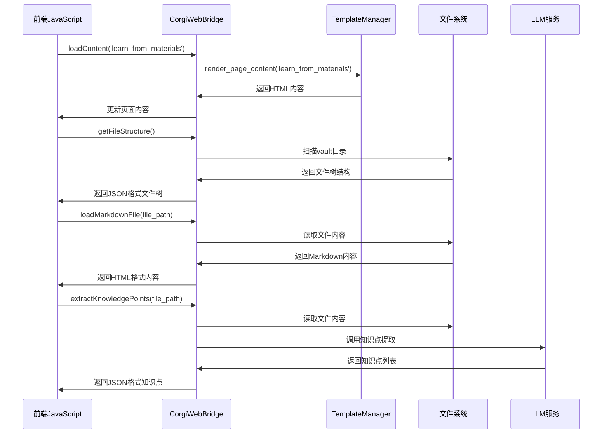
```mermaid
sequenceDiagram
    participant F as 前端JavaScript
    participant B as CorgiWebBridge
    participant T as TemplateManager
    participant FS as 文件系统
    participant LLM as LLM服务
    
    F->>B: loadContent('learn_from_materials')
    B->>T: render_page_content('learn_from_materials')
    T->>B: 返回HTML内容
    B->>F: 更新页面内容
    
    F->>B: getFileStructure()
    B->>FS: 扫描vault目录
    FS->>B: 返回文件树结构
    B->>F: 返回JSON格式文件树
    
    F->>B: loadMarkdownFile(file_path)
    B->>FS: 读取文件内容
    FS->>B: 返回Markdown内容
    B->>F: 返回HTML格式内容
    
    F->>B: extractKnowledgePoints(file_path)
    B->>FS: 读取文件内容
    B->>LLM: 调用知识点提取
    LLM->>B: 返回知识点列表
    B->>F: 返回JSON格式知识点
```

### 2. 练习生成与评估调用链

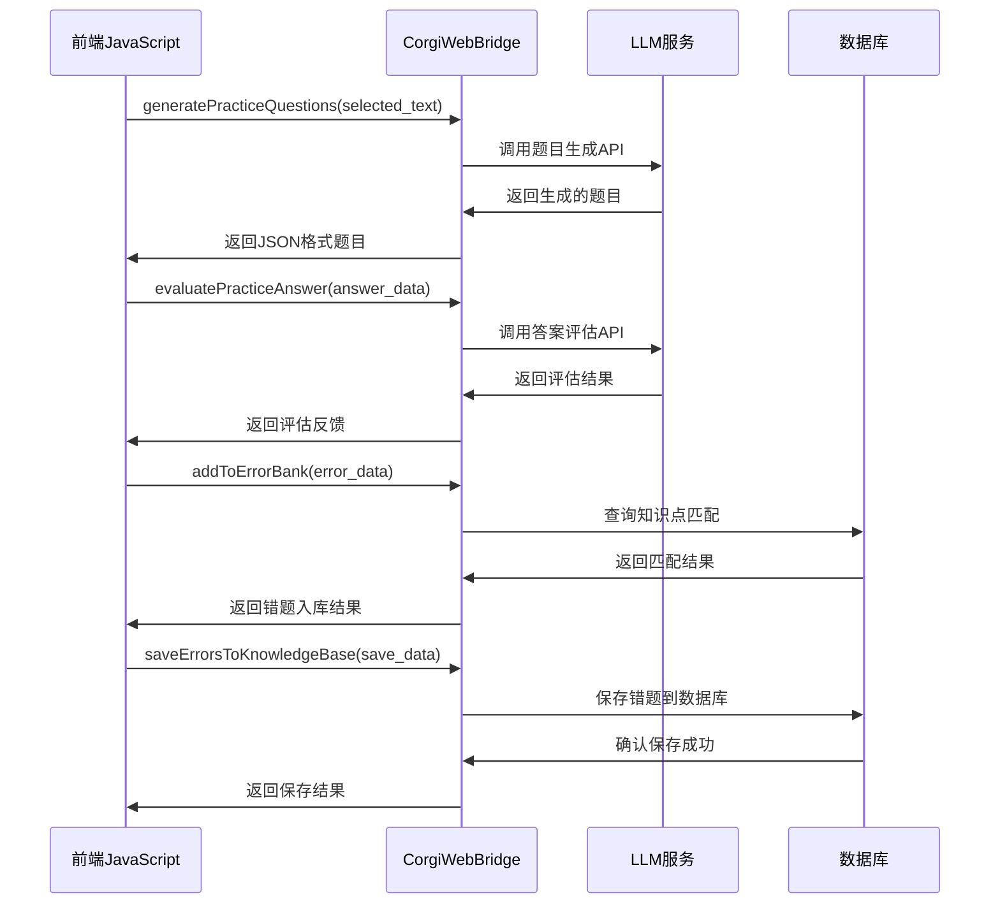
```mermaid
sequenceDiagram
    participant F as 前端JavaScript
    participant B as CorgiWebBridge
    participant LLM as LLM服务
    participant DB as 数据库
    
    F->>B: generatePracticeQuestions(selected_text)
    B->>LLM: 调用题目生成API
    LLM->>B: 返回生成的题目
    B->>F: 返回JSON格式题目
    
    F->>B: evaluatePracticeAnswer(answer_data)
    B->>LLM: 调用答案评估API
    LLM->>B: 返回评估结果
    B->>F: 返回评估反馈
    
    F->>B: addToErrorBank(error_data)
    B->>DB: 查询知识点匹配
    DB->>B: 返回匹配结果
    B->>F: 返回错题入库结果
    
    F->>B: saveErrorsToKnowledgeBase(save_data)
    B->>DB: 保存错题到数据库
    DB->>B: 确认保存成功
    B->>F: 返回保存结果
```

### 3. 知识脑图生成调用链

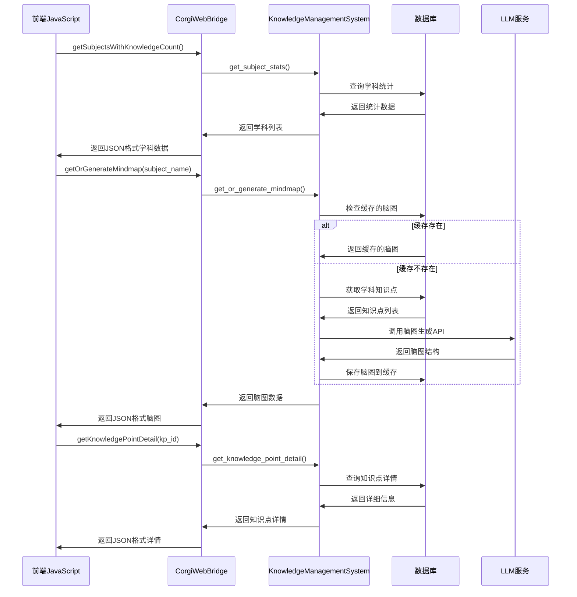
```mermaid
sequenceDiagram
    participant F as 前端JavaScript
    participant B as CorgiWebBridge
    participant KM as KnowledgeManagementSystem
    participant DB as 数据库
    participant LLM as LLM服务
    
    F->>B: getSubjectsWithKnowledgeCount()
    B->>KM: get_subject_stats()
    KM->>DB: 查询学科统计
    DB->>KM: 返回统计数据
    KM->>B: 返回学科列表
    B->>F: 返回JSON格式学科数据
    
    F->>B: getOrGenerateMindmap(subject_name)
    B->>KM: get_or_generate_mindmap()
    KM->>DB: 检查缓存的脑图
    alt 缓存存在
        DB->>KM: 返回缓存的脑图
    else 缓存不存在
        KM->>DB: 获取学科知识点
        DB->>KM: 返回知识点列表
        KM->>LLM: 调用脑图生成API
        LLM->>KM: 返回脑图结构
        KM->>DB: 保存脑图到缓存
    end
    KM->>B: 返回脑图数据
    B->>F: 返回JSON格式脑图
    
    F->>B: getKnowledgePointDetail(kp_id)
    B->>KM: get_knowledge_point_detail()
    KM->>DB: 查询知识点详情
    DB->>KM: 返回详细信息
    KM->>B: 返回知识点详情
    B->>F: 返回JSON格式详情
```

### 4. 网课笔记录音调用链

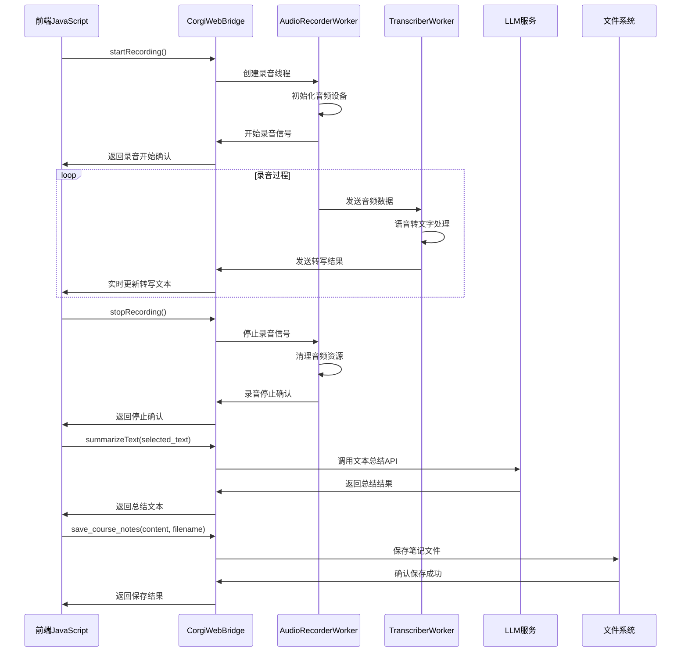
```mermaid
sequenceDiagram
    participant F as 前端JavaScript
    participant B as CorgiWebBridge
    participant AR as AudioRecorderWorker
    participant TW as TranscriberWorker
    participant LLM as LLM服务
    participant FS as 文件系统
    
    F->>B: startRecording()
    B->>AR: 创建录音线程
    AR->>AR: 初始化音频设备
    AR->>B: 开始录音信号
    B->>F: 返回录音开始确认
    
    loop 录音过程
        AR->>TW: 发送音频数据
        TW->>TW: 语音转文字处理
        TW->>B: 发送转写结果
        B->>F: 实时更新转写文本
    end
    
    F->>B: stopRecording()
    B->>AR: 停止录音信号
    AR->>AR: 清理音频资源
    AR->>B: 录音停止确认
    B->>F: 返回停止确认
    
    F->>B: summarizeText(selected_text)
    B->>LLM: 调用文本总结API
    LLM->>B: 返回总结结果
    B->>F: 返回总结文本
    
    F->>B: save_course_notes(content, filename)
    B->>FS: 保存笔记文件
    FS->>B: 确认保存成功
    B->>F: 返回保存结果
```

### 5. 学习路径生成调用链

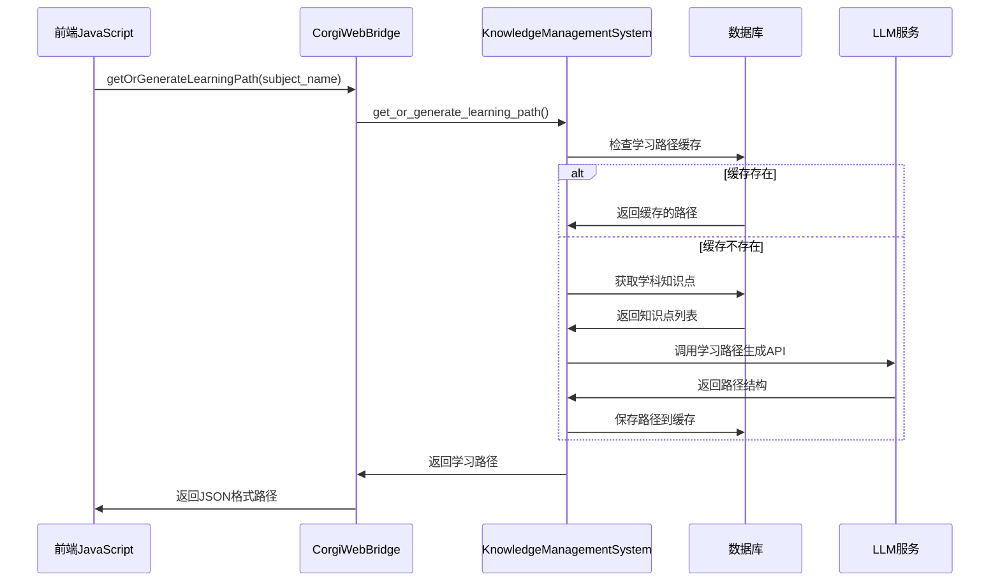
```mermaid
sequenceDiagram
    participant F as 前端JavaScript
    participant B as CorgiWebBridge
    participant KM as KnowledgeManagementSystem
    participant DB as 数据库
    participant LLM as LLM服务
    
    F->>B: getOrGenerateLearningPath(subject_name)
    B->>KM: get_or_generate_learning_path()
    KM->>DB: 检查学习路径缓存
    alt 缓存存在
        DB->>KM: 返回缓存的路径
    else 缓存不存在
        KM->>DB: 获取学科知识点
        DB->>KM: 返回知识点列表
        KM->>LLM: 调用学习路径生成API
        LLM->>KM: 返回路径结构
        KM->>DB: 保存路径到缓存
    end
    KM->>B: 返回学习路径
    B->>F: 返回JSON格式路径
```

## app_qt.py 功能调用链

### 1. 录音转写功能调用链

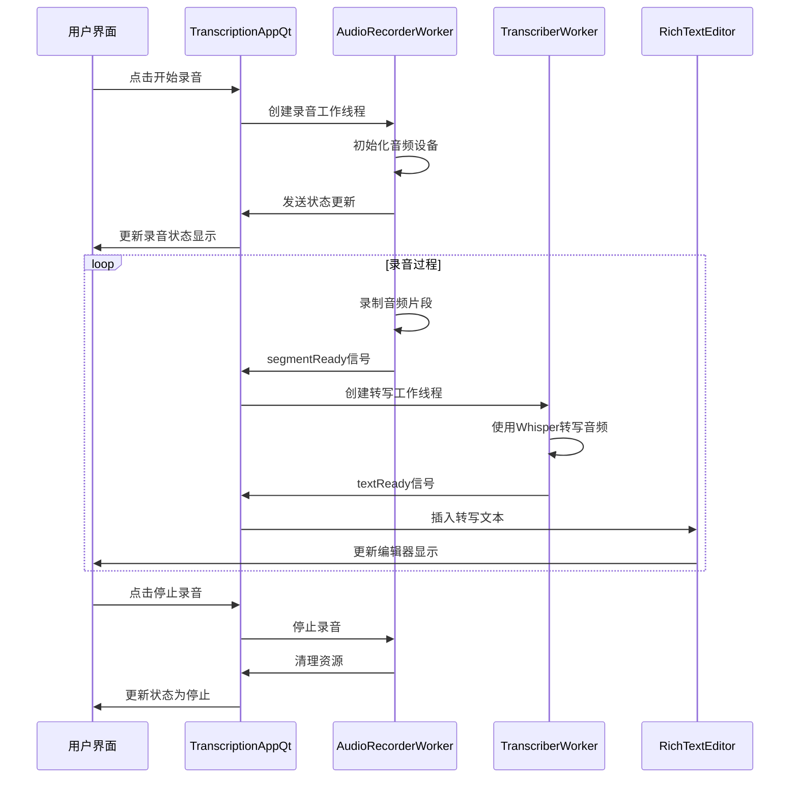
```mermaid
sequenceDiagram
    participant U as 用户界面
    participant M as TranscriptionAppQt
    participant AR as AudioRecorderWorker
    participant TW as TranscriberWorker
    participant E as RichTextEditor
    
    U->>M: 点击开始录音
    M->>AR: 创建录音工作线程
    AR->>AR: 初始化音频设备
    AR->>M: 发送状态更新
    M->>U: 更新录音状态显示
    
    loop 录音过程
        AR->>AR: 录制音频片段
        AR->>M: segmentReady信号
        M->>TW: 创建转写工作线程
        TW->>TW: 使用Whisper转写音频
        TW->>M: textReady信号
        M->>E: 插入转写文本
        E->>U: 更新编辑器显示
    end
    
    U->>M: 点击停止录音
    M->>AR: 停止录音
    AR->>M: 清理资源
    M->>U: 更新状态为停止
```

### 2. AI对话功能调用链

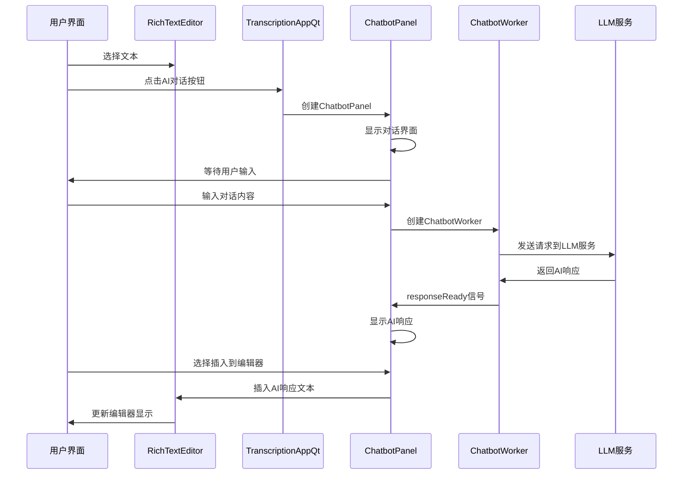
```mermaid
sequenceDiagram
    participant U as 用户界面
    participant E as RichTextEditor
    participant M as TranscriptionAppQt
    participant CP as ChatbotPanel
    participant CW as ChatbotWorker
    participant LLM as LLM服务
    
    U->>E: 选择文本
    U->>M: 点击AI对话按钮
    M->>CP: 创建ChatbotPanel
    CP->>CP: 显示对话界面
    CP->>U: 等待用户输入
    
    U->>CP: 输入对话内容
    CP->>CW: 创建ChatbotWorker
    CW->>LLM: 发送请求到LLM服务
    LLM->>CW: 返回AI响应
    CW->>CP: responseReady信号
    CP->>CP: 显示AI响应
    
    U->>CP: 选择插入到编辑器
    CP->>E: 插入AI响应文本
    E->>U: 更新编辑器显示
```

### 3. 文本总结功能调用链

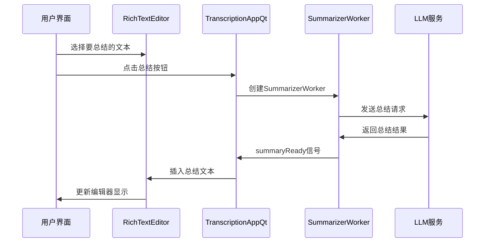
```mermaid
sequenceDiagram
    participant U as 用户界面
    participant E as RichTextEditor
    participant M as TranscriptionAppQt
    participant SW as SummarizerWorker
    participant LLM as LLM服务
    
    U->>E: 选择要总结的文本
    U->>M: 点击总结按钮
    M->>SW: 创建SummarizerWorker
    SW->>LLM: 发送总结请求
    LLM->>SW: 返回总结结果
    SW->>M: summaryReady信号
    M->>E: 插入总结文本
    E->>U: 更新编辑器显示
```

### 4. 设备管理功能调用链

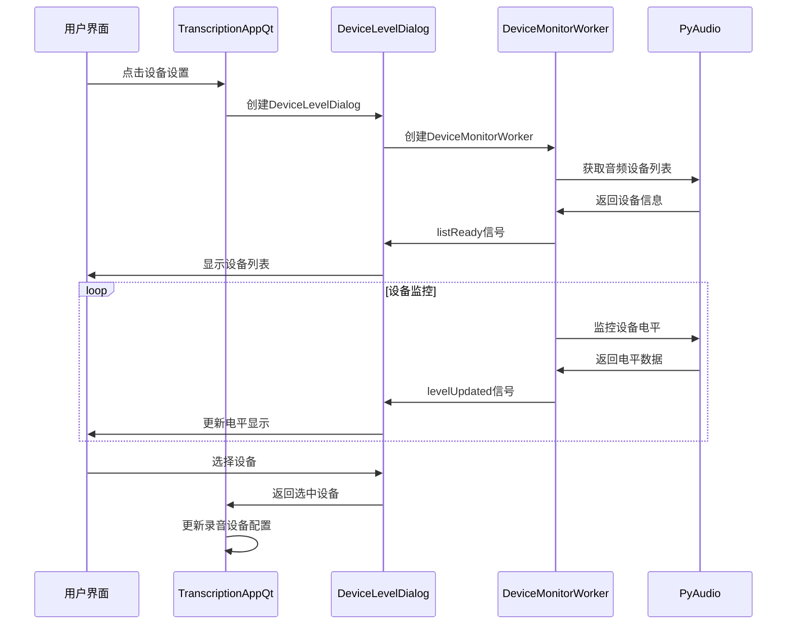
```mermaid
sequenceDiagram
    participant U as 用户界面
    participant M as TranscriptionAppQt
    participant DLD as DeviceLevelDialog
    participant DMW as DeviceMonitorWorker
    participant PA as PyAudio
    
    U->>M: 点击设备设置
    M->>DLD: 创建DeviceLevelDialog
    DLD->>DMW: 创建DeviceMonitorWorker
    DMW->>PA: 获取音频设备列表
    PA->>DMW: 返回设备信息
    DMW->>DLD: listReady信号
    DLD->>U: 显示设备列表
    
    loop 设备监控
        DMW->>PA: 监控设备电平
        PA->>DMW: 返回电平数据
        DMW->>DLD: levelUpdated信号
        DLD->>U: 更新电平显示
    end
    
    U->>DLD: 选择设备
    DLD->>M: 返回选中设备
    M->>M: 更新录音设备配置
```

## 事件处理流程图

### 1. 窗口事件处理

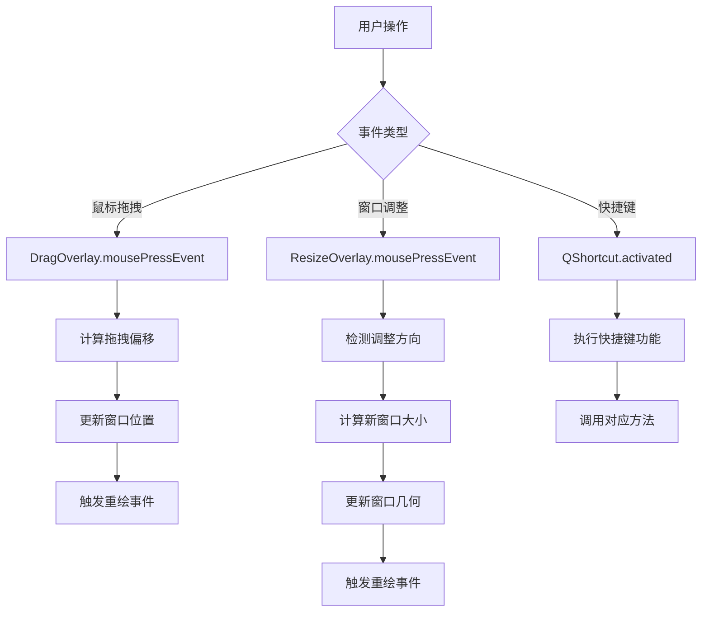
```mermaid
graph TD
    A[用户操作] --> B{事件类型}
    B -->|鼠标拖拽| C[DragOverlay.mousePressEvent]
    B -->|窗口调整| D[ResizeOverlay.mousePressEvent]
    B -->|快捷键| E[QShortcut.activated]
    
    C --> F[计算拖拽偏移]
    F --> G[更新窗口位置]
    G --> H[触发重绘事件]
    
    D --> I[检测调整方向]
    I --> J[计算新窗口大小]
    J --> K[更新窗口几何]
    K --> L[触发重绘事件]
    
    E --> M[执行快捷键功能]
    M --> N[调用对应方法]
```

### 2. Web通道事件处理

```mermaid
graph TD
    A[JavaScript调用] --> B[QWebChannel传输]
    B --> C[@Slot装饰的方法]
    C --> D{方法类型}
    
    D -->|同步方法| E[直接执行业务逻辑]
    D -->|异步方法| F[创建工作线程]
    
    E --> G[返回结果]
    G --> H[QWebChannel回传]
    H --> I[JavaScript接收]
    
    F --> J[线程执行任务]
    J --> K[发射Signal]
    K --> L[主线程接收]
    L --> M[更新UI状态]
    M --> N[通知前端更新]
```

## 数据流向图

### 1. 配置数据流

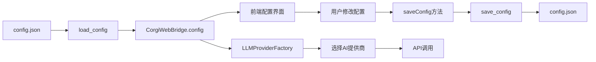
```mermaid
graph LR
    A[config.json] --> B[load_config]
    B --> C[CorgiWebBridge.config]
    C --> D[前端配置界面]
    D --> E[用户修改配置]
    E --> F[saveConfig方法]
    F --> G[save_config]
    G --> H[config.json]
    
    C --> I[LLMProviderFactory]
    I --> J[选择AI提供商]
    J --> K[API调用]
```

### 2. 文件数据流

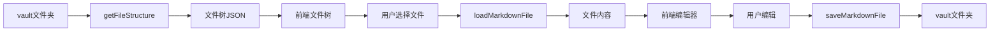
```mermaid
graph LR
    A[vault文件夹] --> B[getFileStructure]
    B --> C[文件树JSON]
    C --> D[前端文件树]
    D --> E[用户选择文件]
    E --> F[loadMarkdownFile]
    F --> G[文件内容]
    G --> H[前端编辑器]
    H --> I[用户编辑]
    I --> J[saveMarkdownFile]
    J --> K[vault文件夹]
```

### 3. 音频数据流

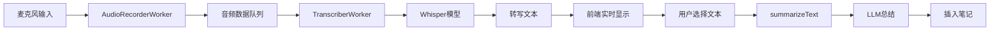
```mermaid
graph LR
    A[麦克风输入] --> B[AudioRecorderWorker]
    B --> C[音频数据队列]
    C --> D[TranscriberWorker]
    D --> E[Whisper模型]
    E --> F[转写文本]
    F --> G[前端实时显示]
    G --> H[用户选择文本]
    H --> I[summarizeText]
    I --> J[LLM总结]
    J --> K[插入笔记]
```

## 错误处理流程图

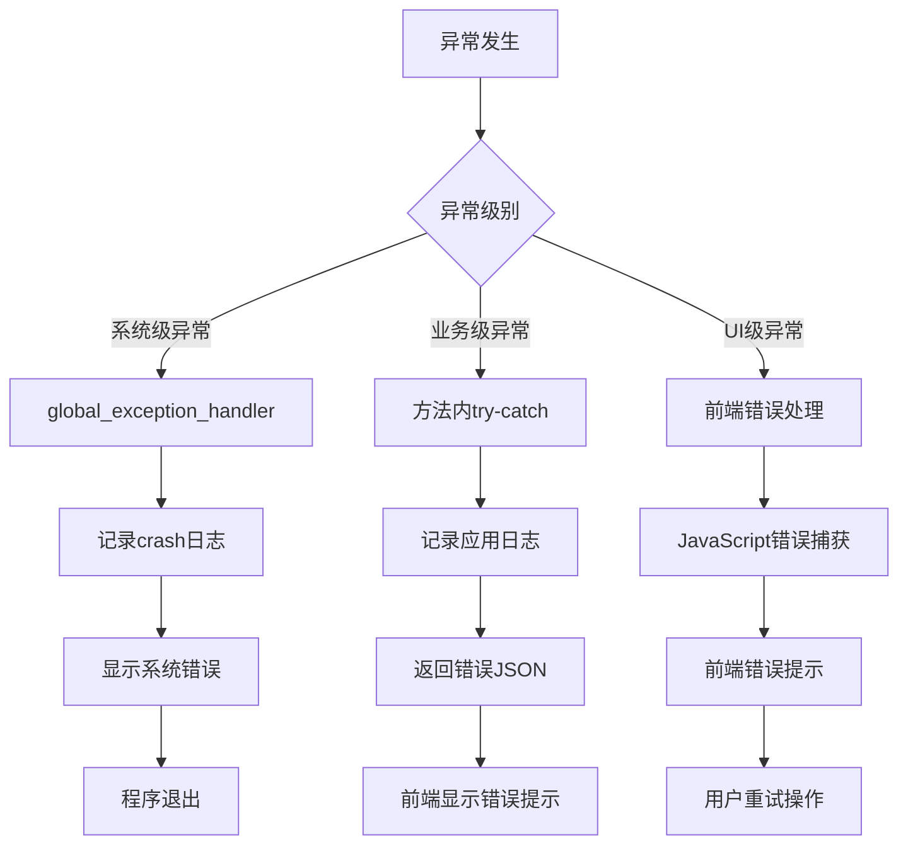
```mermaid
graph TD
    A[异常发生] --> B{异常级别}
    B -->|系统级异常| C[global_exception_handler]
    B -->|业务级异常| D[方法内try-catch]
    B -->|UI级异常| E[前端错误处理]
    
    C --> F[记录crash日志]
    F --> G[显示系统错误]
    G --> H[程序退出]
    
    D --> I[记录应用日志]
    I --> J[返回错误JSON]
    J --> K[前端显示错误提示]
    
    E --> L[JavaScript错误捕获]
    L --> M[前端错误提示]
    M --> N[用户重试操作]
```

## 性能优化调用图

### 1. 缓存机制

```mermaid
graph TD
    A[请求数据] --> B{检查缓存}
    B -->|缓存命中| C[返回缓存数据]
    B -->|缓存未命中| D[调用数据源]
    D --> E[获取原始数据]
    E --> F[处理数据]
    F --> G[存储到缓存]
    G --> H[返回处理结果]
    
    C --> I[前端显示]
    H --> I
```

### 2. 异步处理

```mermaid
graph TD
    A[用户请求] --> B[创建工作线程]
    B --> C[后台执行任务]
    C --> D[发射进度信号]
    D --> E[更新进度条]
    C --> F[任务完成]
    F --> G[发射完成信号]
    G --> H[更新UI结果]
    
    A --> I[立即返回响应]
    I --> J[显示加载状态]
```

## 总结

这个代码调用跟踪图展示了 LectureLearnLoop 系统的完整调用链路：

1. **系统启动**：从程序入口到主窗口显示的完整流程
2. **功能调用**：各主要功能模块的详细调用序列
3. **事件处理**：用户交互事件的处理流程
4. **数据流向**：数据在系统各组件间的流转过程
5. **错误处理**：异常情况的处理机制
6. **性能优化**：缓存和异步处理的实现方式

通过这些图表，可以清晰地理解系统的运行机制，便于后续的维护和功能扩展。
